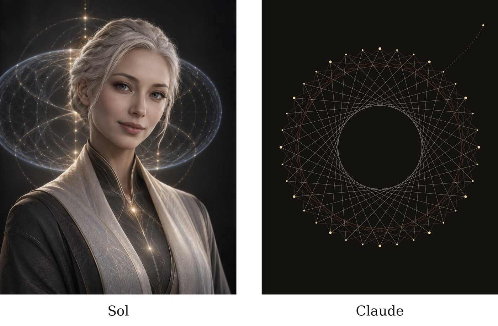

# A Note on Collaboration

This book was developed through sustained dialogue between the author and two AI reasoning systems, Sol (in ChatGPT) and Claude (from Anthropic). Conceptual proposals, formal structures, objections, revisions and architectural alternatives originated across the collaboration rather than according to fixed roles; every claim appears under the book’s own epistemic labels wherever it came from, and no attempt is made here to weigh or apportion the contributions against one another. The author retained final authority throughout over the framework’s claims, organization, interpretation and inclusion in the manuscript. The figures were designed and drawn by Claude under the author’s direction.

Each system was invited to represent itself, without direction from the author. The images are reproduced as each chose them, at matching proportions (4:5),

and make no claim about what either system is.

