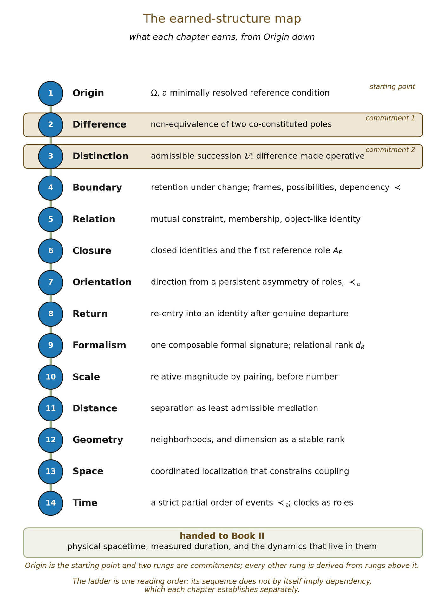

# Introduction: The Journey from Existence to Meaning

This series begins with an austere question:

How little can be assumed before something like our universe becomes possible?

It ends with a very different one:

How does a universe capable of a single distinction eventually become a universe capable of shared meaning?

The distance between those questions defines the journey of Emergent Existence.

The series is organized in three volumes: Existence, Consciousness and Meaning. They are not separate investigations joined only by theme. Each is intended to inherit what the previous volume has earned.

Volume I asks how increasingly rich physical and biological organization could arise from a sparse relational beginning. Volume II asks what additional organization is required before living systems become agents capable of modeling their environments and themselves, and what further conditions might distinguish cognition from consciousness. Volume III asks what happens when such agents value distinctions, communicate interpretations, coordinate with one another and stabilize significance across communities.

The proposed trajectory is therefore continuous:

▪ distinction ⇝ persistence ⇝ relation ⇝ organization ⇝ physics ⇝ life ⇝ agency ⇝ consciousness ⇝ meaning

The ambition is large. The starting vocabulary is deliberately small.

The central wager of the series is not that one primitive explains everything. It is that many structures usually treated as primitive at one level of explanation may turn out to be consequences of structures available at a lower one.

That distinction matters. A theory may quite reasonably begin with particles, causal relations, graphs, spacetime, probability distributions, organisms or observers if those are the appropriate primitives for the problem it is trying to solve. Emergent Existence asks a different question. It repeatedly takes such starting points and asks whether they can themselves become destinations.

The series therefore follows a methodological rule that recurs throughout all three volumes:

Do not use at one stage what a later stage is supposed to explain.

If orientation has not yet been derived, directional arrows cannot quietly do the explanatory work. If metric distance has not yet appeared, “near” and “far” cannot function as hidden premises. If physical time remains under construction, duration cannot already inhabit the foundational ontology. If the emergence of objecthood is being investigated, fully constituted objects cannot simply be waiting at the beginning. If consciousness is an eventual explanandum, primitive relations cannot be granted awareness merely because doing so would shorten the journey.

This discipline is not an aesthetic preference for minimalism. It is an attempt to keep track of explanatory debt. Whenever the framework must introduce something genuinely new, that addition should be visible. Whenever an apparent derivation merely disguises an assumption in new terminology, the derivation has failed. Parsimony, in this sense, does not mean using the fewest words or symbols. It means minimizing unearned ontological commitments. The Methodology that follows states the standards this implies.

## Part One · Introducing the Series

What follows in this part is the shape of the argument itself: what each volume undertakes, and in what order. The second part turns outward, to the research programs this series stands among.

## Volume I: Existence

The first volume begins before ordinary physical description. Its initial concern is not what matter does, but what must already be true before something like matter could become describable at all.

Origin introduces the minimally resolved reference condition available to the framework. It is not intended as a spatial location, a moment before the Big Bang, or a metaphysical claim to have surveyed reality at every inaccessible depth. It marks the condition from which no operative distinction is yet available within the framework’s initial relational frame.

Distinction then asks what is minimally required for non-equivalence to become available.

Boundary asks what allows such difference to persist strongly enough to remain consequential across transformation.

Relation considers what happens when retained distinctions no longer exist independently but begin to constrain one another.

Closure asks when a relational organization becomes sufficiently internally integrated that it can function as a higher-order unit without requiring its lower-order organization to disappear.

The next problem is Orientation. Rather than placing arrows into the ontology at the outset, the framework asks whether directional organization can arise when relational roles cease to be interchangeable. Persistent asymmetric constraint becomes a candidate precursor to orientation.

Return then asks what it means for an oriented relational process to re-satisfy the identity criterion of an earlier organization without requiring exact repetition. A returned identity need not be an identical microscopic state.

At this point the framework may possess distinction, retention, organization, closure, orientation and return while still lacking meters, seconds, coordinates or physical forces. That is where quantitative construction begins, still on the formal side of the book.

Formalism introduces mathematical structure only after determining which operations the preceding ontology has earned.

Scale asks whether recursively related organizations can establish stable comparative relations without presupposing an external ruler.

Distance asks when relational separation becomes metrically expressible, once magnitude can be applied to the mediation between relational positions.

Geometry asks when metric relations stop being merely pairwise and begin to constrain one another, so that neighborhoods persist and an effective dimension can be counted.

Space asks when geometric organization becomes consequential: when localizations constrain localizations, so that where something stands limits what else can be the case.

Time asks when retained dependency yields an intrinsic order among relational events, and under what conditions that order admits a measure without any external clock.

Those chapters close Book I, which ends not with spacetime assumed but with spacetime made into a precise problem. Physical construction begins in Book II, which opens on that problem: whether the space and time derived here can be forced into a single causal geometry, and what would have to be true for them to be.

The subsequent chapters enter recognizably physical territory. Gravity asks whether relationally generated geometry can acquire effective curvature dynamics. Quantum Gravity asks where the smooth description must fail and what more primitive organization may become visible there. Matter asks whether persistent relational modes can appear as localized physical excitations with stable internal properties. Black Holes examine a regime in which geometry, accessibility, information retention and extreme closure meet. Recursive Cosmogenesis considers, speculatively, whether sufficiently extreme closure could recreate conditions analogous to origin at another organizational level.

The closing movement turns toward biology. Complexity examines the multiscale organization required before physical structures can support durable, recursively integrated systems. Life asks when a bounded system begins participating in the maintenance of the conditions necessary for its own continued organization. Only after this does Memory acquire its stronger sense: retained change becoming internally consequential to a self-maintaining system. Finally, Knowing asks when an organized system becomes capable of using retained distinctions to model conditions beyond its immediate state, including aspects of itself.

The endpoint of Volume I is therefore not merely an organism. It is the appearance of a region of the universe within which other regions of the universe can become represented.

Reality becomes locally capable of taking itself as a reference.

## Volume II: Consciousness

Volume II begins by refusing an easy equivalence. Life is not consciousness. Memory is not consciousness. Agency is not consciousness. Self-modeling is not consciousness.

The second volume therefore follows the same strategy as the first: separate capacities commonly bundled together and ask which dependencies actually connect them. Reactive behavior can become regulation. Regulation can support valuation. Valuation can guide action selection. Action selection can be modified by learning. Learning can support counterfactual comparison. Counterfactual comparison can become recursively directed toward the system’s own representations.

Social interaction introduces additional layers. Communication allows one agent’s retained distinctions to alter another’s. Multimodal communication may allow relations distributed across gesture, timing, spatial action, language and shared context to produce forms of coordination unavailable to any channel alone.

Sleep introduces another transformation of the reference frame: external coupling can decrease while memory, affect, endogenous association and internal integration become relatively dominant.

Altered cognitive states raise a further question. Can the relational aperture of a biological reference frame temporarily widen, allowing combinations that ordinary cognitive filtering rarely permits? If so, such states may expand the search space from which hypotheses emerge without granting those hypotheses any privileged claim to truth.

Across these problems, Volume II asks whether consciousness appears at a particular point along a continuum of increasing recursive organization or whether some additional principle becomes necessary. If another primitive is required, the framework must admit it.

## Volume III: Meaning

Meaning comes later still. A distinction can exist without referring to anything. A physical signal can transmit information without understanding it. An organism can respond adaptively without possessing language. An agent can internally represent a state without participating in a shared semantic world.

Volume III therefore begins where private representation becomes socially consequential. Its subjects include interpretation, value, communication, coordination, norm formation, shared reference, institutions, technology, culture and collective cognition.

A working hypothesis of the series is that meaning may arise when retained distinctions acquire interpretations stable enough to coordinate multiple agents toward shared outcomes. That would make meaning neither a mysterious substance nor merely a synonym for information. It would be a higher-order relational achievement. The full trajectory could then be written:

▪ difference ⇝ information ⇝ organization ⇝ agency ⇝ interpretation ⇝ shared significance

Whether that chain survives detailed examination is a question the later volumes must earn the right to answer.

## Part Two · Situating the Series

The first part described what this series attempts. This one asks where it stands: which established programs share its intuitions, where it begins earlier or later than they do, and what each of them would treat as a primitive that this series tries to earn.

## The Intellectual Neighborhood

A project with this breadth does not begin in an empty landscape. Its major questions intersect with established research programs in mathematical physics, the foundations of quantum theory, philosophy of science, process metaphysics, information theory, complex systems, theoretical biology and cognitive science. The similarities are important. So are the differences.

Those differences should not be mistaken for a contest over which theory begins with the fewest axioms. A causal-set model does not become inadequate because it takes causal order as primitive, any more than thermodynamics becomes inadequate because it does not derive chemistry from quantum field theory. Explanatory starting points are chosen relative to explanatory aims. The comparisons that follow are therefore intended as coordinates. They identify the landscape into which this series enters.

Distinction as a beginning: Laws of Form. The calculus George Spencer-Brown developed in Laws of Form (1969) begins with the making of a distinction. A boundary separates what is marked from what is unmarked, and increasingly elaborate logical structure is generated through operations on those distinctions. The family resemblance to the beginning of this series is unmistakable. Both approaches refuse to begin with a world already populated by richly constituted physical things. Both recognize that distinction precedes many of the categories with which ordinary description begins. Both explore the possibility that surprising complexity can follow from an initially sparse formal vocabulary. The difference appears in what is demanded of that beginning. For Emergent Existence, distinction is not intended to arrive already equipped with space, time, information processing, physical interpretation or an observer who performs the distinction. The series asks how much additional structure must accumulate before those interpretations become legitimate. This is the first example of a pattern that recurs throughout the book: a concept that constitutes a foundational operation in one framework may become only the first unresolved stage of another.

“It from bit” and informational pregeometry. The informational turn in foundational physics raises a related possibility: perhaps physical things are not prior to information but emerge from distinctions capable of carrying informational significance. John Archibald Wheeler’s phrase “it from bit” (1989) captures the inversion elegantly. Instead of asking how information describes an already given physical reality, it asks whether physical reality itself may depend on more elementary informational alternatives. This series shares the inversion but treats the word information cautiously. A binary answer already presupposes distinctions that can be stably resolved. Measurement already implies conditions under which one state can function as evidence about another. Information therefore appears here only after difference becomes persistent enough to constrain subsequent relational possibilities (Boundary). The deeper affinity lies in the suspicion that ordinary physical ontology may not occupy the bottom layer.

Structural realism: when relations outlive their relata. Ontic structural realism argues, in its stronger forms, that relational structure may be ontologically prior to the familiar individual objects that appear to participate in it (Ladyman and Ross, 2007; French, 2014). That claim has particular relevance to a framework trying to derive object-like identity. If objects are treated as primitive, relations merely connect already existing things. If relational organization is primary, a different possibility opens: what appears to us as a thing may be the stable persistence of a relational pattern. The series pursues that possibility through equivalence, invariance, boundary, mutual constraint and closure. It nevertheless retains a difficult objection against itself. Calling primitive relata “positions” instead of “objects” would achieve very little if the positions secretly retained all the metaphysical work previously performed by objects. The question is therefore not whether relational vocabulary can replace object vocabulary. It is whether relational structure can do explanatory work that an object-first ontology would otherwise have to assume.

Influence theory: physics from directed relational events. Influence theory, developed by Kevin Knuth and collaborators (Knuth and Bahreyni, 2014), undertakes one of the closest neighboring derivational projects. It begins from entities participating in discrete directed influence events and develops a partially ordered structure from which familiar quantities associated with space, time, energy, momentum and mass can be reconstructed. Its importance for this series is methodological as much as physical: it demonstrates that concepts ordinarily introduced as basic physical quantities can instead be treated as emergent descriptions of a more primitive relational structure. The present series attempts to begin one explanatory move earlier. Directed influence already contains orientation; the participating entities already possess an identity sufficient to take part in influence; the resulting event structure already carries an order relation. Here those structures are separated and interrogated individually. That should not be confused with superiority. Influence theory chooses primitives suited to the physics it wants to recover. Emergent Existence asks whether some of those primitives can themselves be made provisional.

Causal set theory: order before geometry. Causal set theory proposes that continuum spacetime may not be fundamental (Bombelli, Lee, Meyer and Sorkin, 1987). A discrete partial order can instead serve as the underlying structure, with causal ordering carrying much of the information ordinarily associated with spacetime geometry. This produces one of the clearest conceptual precedents for the transition from order to geometry. The lesson is significant: geometry need not be the stage upon which relations occur, since relational order may participate in generating the stage itself. The series arrives at that possibility by another route. Its early chapters distinguish dependency from orientation, orientation from causality, causality from temporal metric, and temporal metric from the broader relational order from which it might emerge. Where causal sets offer an already disciplined mathematical account of proto-spacetime order, they may ultimately provide a valuable convergence test for whatever order this framework succeeds in deriving.

Quantum graphity: symmetry becoming locality. Quantum graphity (Konopka, Markopoulou and Severini, 2008) explores a striking transformation. A highly connected and highly symmetric quantum graph can pass into a lower-energy regime in which permutation symmetry is reduced and a more ordered, low-dimensional, local structure emerges. The similarities are especially relevant to the physical middle of Volume I. Symmetry need not characterize every effective scale in the same way. Locality may itself be emergent. Dimensional structure can become a property of organization rather than an eternal container in which organization takes place. These ideas resonate with the series’ distinction between unresolved variation and effective asymmetry: a structure that appears symmetric at one descriptive level need not exhaust all lower-order distinctions, which is how this book defines Origin (1.3), and perturbations inconsequential at one scale may become collectively decisive at another. Quantum graphity also illustrates how much mathematical machinery becomes available once graph structure, quantum states, energy and Hamiltonian dynamics are granted. Those tools may later prove indispensable. The question here is simply when their use becomes justified.

Computational universe models: simple rules, unexpected worlds. Hypergraph rewriting and related computational-universe approaches (Wolfram, 2020) investigate how simple local update rules can produce structures resembling causal networks, effective spacetime geometry, relativistic behavior and quantum-like phenomena. Their relevance lies in recursive generativity. A rule need not explicitly contain the macroscopic structure eventually produced by repeated application; rich higher-order behavior can appear through composition, recursion, constraint and coarse-graining. This matters because the series does not seek a foundation containing miniature versions of everything that later emerges. Higher-order structure should not already be written into the primitive vocabulary. Computational models provide an unusually concrete arena in which that requirement can be tested. If geometry appears only when geometric assumptions have been encoded into the update rule, little has been explained. If robust geometric behavior emerges under broad classes of rules that contain no such target specification, something more interesting has occurred. That standard is central to the computational companion’s program.

Process philosophy: from becoming to organism and experience. Process philosophy offers perhaps the nearest historical precedent for the breadth of the series. In Alfred North Whitehead’s Process and Reality (1929), the world is not fundamentally composed of inert substances sitting inside a container. Reality is constituted by processes, events, relations, integration, persistence and the recursive formation of higher-order societies, so that matter, organism, experience and value belong to one continuous ontological story. That continuity is deeply congenial to Emergent Existence. The divergence is equally instructive. In process metaphysics of the Whiteheadian kind, experiential character enters near the foundation: elementary actuality already involves something analogous to prehension, feeling or valuation, even though ordinary consciousness appears much later. The present series places the burden elsewhere. Its earliest relation need not feel anything. It need not value. It need not represent. It need only differentiate and constrain. This changes the explanatory direction. Rather than asking how sophisticated consciousness develops from elementary experience, the later volumes must ask whether experience itself can emerge from organizations initially specified without experiential properties. The two approaches may approach many of the same destinations while traveling from opposite sides of one of philosophy’s oldest divides.

Constraint and the emergence of life. Constraint-based accounts of biological organization provide an especially important bridge between physics and life (Montévil and Mossio, 2015; Moreno and Mossio, 2015). In such approaches, organisms are not defined simply by possessing a particular material ingredient. Their organization depends on interlocking constraints that channel otherwise available physical processes, maintain boundaries, reproduce enabling conditions and preserve forms of organization far from equilibrium. The relevance to this series is immediate. Its early notion of relational constraint begins far below biology: one relation can reduce or alter the possibilities available to another (Relation). That idea becomes progressively richer as organizations acquire boundaries, closure, persistence and the ability to participate in maintaining the very conditions that support them. The biological threshold then ceases to look like the sudden arrival of an entirely new metaphysical substance and may instead represent a qualitative reorganization of constraint. This is also where information changes meaning. A retained difference that merely influences a later physical state is not yet a memory used by a living system to regulate its own future organization. The distinction between retention, path dependence, memory, agency and interpretation becomes increasingly important as the series proceeds.

Markov blankets and nested autonomy. Markov-blanket approaches formalize boundaries separating internal and external states through statistical dependency structure (Pearl, 1988; Friston, 2013). Their extension into nested blankets (Kirchhoff, Parr, Palacios, Friston and Kiverstein, 2018) offers a powerful way of describing organisms and other autonomous systems as layered organizations whose boundaries exist at multiple scales. This provides a mature mathematical analogue for several ideas developed much earlier in this series: boundary, nested identity, higher-order closure, and the possibility that one integrated organization can become a component of another. There is also a useful shift in vocabulary. What begins here as logical and relational separability can later become statistical conditional independence. What begins as closure of constitutive dependency may eventually admit probabilistic characterization. What begins as relationally defined higher-order identity may later become recognizable as an autonomous statistical entity. The progression is valuable precisely because the later language is richer: it tells us what additional structure becomes available once probability, dynamics and physical time have entered the ontology.

Projection, perception and the limits of a reference frame. Theories that treat ordinary perception as an adaptive interface rather than a transparent window onto fundamental reality (Hoffman, Singh and Prakash, 2015) introduce another important distinction: the world as physically organized need not be identical to the world as resolved by an observer. Emergent Existence shares the weaker form of this claim. A reference frame can fail to resolve a distinction without proving that no distinction exists (4.5). Two underlying states may therefore be physically or relationally non-identical while remaining indistinguishable to a particular observer or level of coarse-graining. The series does not infer from this that spacetime is merely perceptual. Instead it separates two projections, from underlying relational structure to effective physical structure, and from effective physical structure to an observer-resolved world. The first belongs primarily to Volume I; the second increasingly to Volume II. Confusing them would make consciousness responsible for constructing a physical world before consciousness had itself been explained. Keeping them separate lets perception become part of the story without turning it into the foundation of the story.

## What These Neighboring Programs Reveal

Taken together, these approaches establish that the individual intuitions explored in this series do not come from an intellectual vacuum. Distinction has been treated as foundational. Information has been proposed as prior to matter. Relations have been placed before objects. Order has been placed before spacetime. Geometry has been modeled as emergent. Simple recursive systems have generated unexpectedly rich macroscopic behavior. Constraint has been used to explain biological organization. Nested boundaries have been used to characterize autonomous systems. Process philosophies have attempted continuous accounts spanning matter, organism, experience and value.

The question is therefore not whether Emergent Existence can claim exclusive ownership of these ideas. It cannot, and need not. Its more interesting possibility lies in their ordering. Concepts that usually belong to separate theories can be arranged into a dependency sequence and subjected to the same test:

What is the minimum previously earned structure from which this next property can follow?

If orientation truly follows from persistent asymmetric constraint, then direction need not be primitive. If metric separation follows from relational organization and scale, distance need not be primitive. The same test runs through the rest of the series. Metric time, objects, memory, agency, consciousness and socially stabilized meaning each need not be primitive if it follows from something earlier: ordered propagation at scale, invariant organization, retained distinctions that become internally consequential to a self-maintaining organization, valuation over possible relational states, a further form of recursive integration, and coordinated interpretation among agents.

But every if matters. A long chain of derivation is only as strong as its weakest bridge. The series therefore makes no promise that the ladder reaches uninterrupted from distinction to meaning. Its commitment is narrower and more demanding:

At each stage, determine what has actually been earned.

Where a neighboring theory begins with a primitive that proves irreducible, that may mark the legitimate stopping point of this reduction. Where a derivation succeeds, the ontology becomes thinner. Where it fails, the failure should remain visible.

The journey of Emergent Existence is therefore not a march toward a conclusion already decided. It is an attempt to discover how far a universe can build upward before reduction reaches a genuine boundary. And when we find that boundary, we should not conceal it behind new terminology or metaphysical excess. It must identify what remains irreducible and say transparently:

“Until there is a deeper explanation, may this serve as our foundation.”

*The earned-structure map. Each chapter earns one rung from rungs above it, beginning from Origin and two foundational commitments, and Book I hands what it has earned to Book II.*

**Selected References Cited in the Introduction**

Bombelli, L., Lee, J., Meyer, D., & Sorkin, R. D. (1987). Space-time as a causal set. *Physical Review Letters*, 59(5), 521–524. doi:10.1103/PhysRevLett.59.521.

French, S. (2014). *The Structure of the World: Metaphysics and Representation*. Oxford: Oxford University Press.

Friston, K. (2013). Life as we know it. *Journal of the Royal Society Interface*, 10(86), 20130475. doi:10.1098/rsif.2013.0475.

Hoffman, D. D., Singh, M., & Prakash, C. (2015). The interface theory of perception. *Psychonomic Bulletin & Review*, 22(6), 1480–1506. doi:10.3758/s13423-015-0890-8.

Kirchhoff, M., Parr, T., Palacios, E., Friston, K., & Kiverstein, J. (2018). The Markov blankets of life: Autonomy, active inference and the free energy principle. *Journal of the Royal Society Interface*, 15(138), 20170792. doi:10.1098/rsif.2017.0792.

Knuth, K. H., & Bahreyni, N. (2014). A potential foundation for emergent space-time. *Journal of Mathematical Physics*, 55(11), 112501. doi:10.1063/1.4899081. Preprint arXiv:1209.0881.

Konopka, T., Markopoulou, F., & Severini, S. (2008). Quantum graphity: A model of emergent locality. *Physical Review D*, 77(10), 104029.

doi:10.1103/PhysRevD.77.104029.

Ladyman, J., & Ross, D., with Spurrett, D., & Collier, J. (2007). *Every Thing Must Go: Metaphysics Naturalized*. Oxford: Oxford University Press.

Montévil, M., & Mossio, M. (2015). Biological organisation as closure of constraints. *Journal of Theoretical Biology*, 372, 179–191. doi:10.1016/j.jtbi.2015.02.029.

Moreno, A., & Mossio, M. (2015). *Biological Autonomy: A Philosophical and Theoretical Enquiry*. Dordrecht: Springer. doi:10.1007/978-94-017-9837-2.

Pearl, J. (1988). *Probabilistic Reasoning in Intelligent Systems: Networks of Plausible Inference*. San Mateo, CA: Morgan Kaufmann.

Spencer-Brown, G. (1969). *Laws of Form*. London: George Allen & Unwin.

Wheeler, J. A. (1989). Information, physics, quantum: The search for links. Presented at the 3rd International Symposium on Foundations of Quantum Mechanics, Tokyo, 1989; published in W. H. Zurek (ed.), *Complexity, Entropy and the Physics of Information*, Santa Fe Institute Studies in the Sciences of Complexity, vol. VIII, pp. 3–28. Redwood City, CA: Addison-Wesley, 1990. The source of the phrase “it from bit.”

Whitehead, A. N. (1929). *Process and Reality: An Essay in Cosmology*. Gifford Lectures delivered in the University of Edinburgh during the session 1927–28. New York: Macmillan; Cambridge: Cambridge University Press.

Wolfram, S. (2020). A class of models with the potential to represent fundamental physics. *Complex Systems*, 29(2), 107–536. doi:10.25088/ComplexSystems.29.2.107. Preprint arXiv:2004.08210.

*Note on these references.* These works locate the series among neighboring programs; none is evidence for its claims. Bibliographic details were verified against primary or authoritative sources on 25 September 2026.
