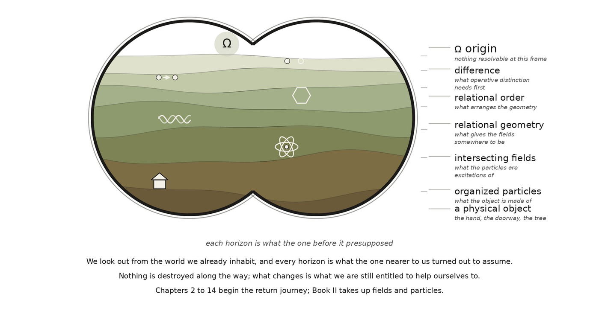

# 1.1 Looking Back from Now

You are reading this book from a world that is apparently navigable. There are objects. Some are near and some are far. Events unfold. Things persist through change. Other people occupy the same surroundings. You remember, anticipate, compare, choose, speak, and ask what any of it means.

From inside that richly organized experience, one question arrives almost effortlessly:

What am I doing here?

It is a small question, but with a great deal to unpack.

“What” assumes that something can be identified. “I” assumes that an organization can distinguish itself from what it is not and persist long enough to refer to itself. “Doing” assumes change. “Here” assumes position, separation, and some structure in which positions can differ. Even the possibility of an answer assumes alternatives: the answer might have been otherwise.

You arrive late to your own question. By the time you can ask about your existence, an immense amount of structure has already been compressed into your perception and your language.

That compression is what makes your lived experience manageable. A map is useful because it leaves out unnecessary details about the land it illustrates, and perception works the same way. Behind a single tree stand more molecular, optical, causal and historical relations than anyone could hold in mind at the same time, yet what reaches you is simply the tree, with a few verdicts that matter based on your intent. For example, does it offer shade; does it bear fruit; can its wood build a raft?

The same simplicity that makes a map useful makes it a poor place to begin a theory of the land.

If we begin from the world exactly as it appears, then much of what we hope to explain has already entered unnoticed. We would be using objecthood to explain objects, spatial intuition to explain space, temporal intuition to explain time, and agency to explain how agency became possible.

So the first movement of this book is not construction. It is conceptual descent.

experienced world ↦ hidden commitments ↦ thinner commitments

*Figure 1.1. The descent to origin, which the rest of the book climbs back from.*

We begin with the compressed world of experience because that is where you already stand. Then we ask what must be removed before the framework stops borrowing the structures it intends to derive.

Your frame motivates the descent, but that frame can no longer be applied once the descent has begun.

There are two distinct frames in play that should not be confused. Yours is rich: perception, embodiment, memory, language, geometry, temporal experience, social interpretation, self-reference. The framework’s initial resolving frame is deliberately poor, the resolving capacity available before any operative distinction has been introduced.

So becomes the prerequisite for reading Emergent Existence:

I ask you to set aside your personal reference frame for a while and take up the framework’s resolving frame instead, which begins with nothing resolved and gains only what each chapter earns. In this way we can make the journey unencumbered by the familiar perspectives we have inherited.
