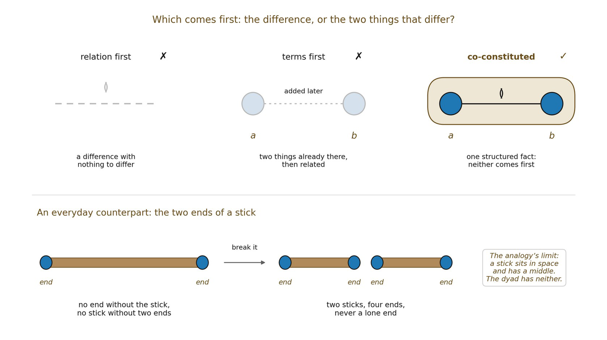

# 2.5 Co-Constitution Rather Than Priority

Two familiar metaphysical pictures are deliberately avoided. The first says that two independently constituted entities exist first and then acquire a relation. The second says that a free-standing relation exists first and somehow generates its relata. Both impose an order that Proposition 2A does not need.

The weaker claim is co-constitution: the dyadic whole, its poles, and their non-self relation are introduced together as one minimal structure. The framework therefore does not answer the general metaphysical question of whether relations or relata are absolutely prior. It chooses only the least structure needed for this derivation.

*Figure 2.1. Neither the difference nor its poles comes first. A difference with*

*nothing to differ is empty, and two things that exist before their difference would make difference a later addition. The dyad is one structured fact, like a stick and its two ends: break the stick and you get two sticks with two ends each, never a lone end. The image of a stick that cannot have only one end is an old one.*
