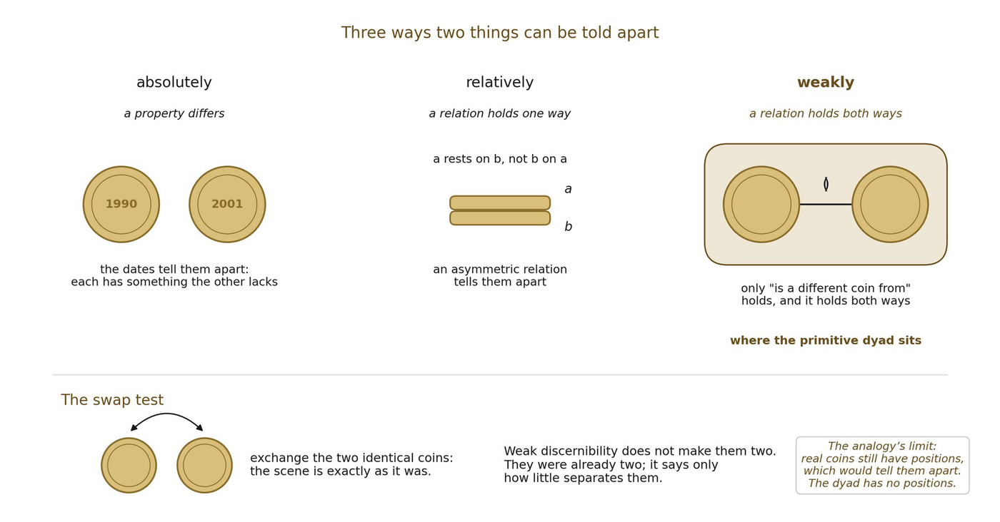

# 2.6 Weak Discernibility Is Diagnostic, Not Generative

The literature on weak discernibility is useful here only if its role is kept narrow. A symmetric irreflexive relation can make two already-admitted poles relationally discernible without assigning either one a distinct intrinsic qualitative property. That is exactly the modest job needed here.

It does not generate numerical diversity. Hawley’s objection (Hawley, 2006) and the circularity concerns discussed by Ladyman, Linnebo and Pettigrew (2012) therefore land if weak discernibility is asked to explain why there are two poles. This framework does not ask it to do so. Numerical dyadicity has already been paid for in Proposition 2A.

Muller’s discussion (2015) of “relationals” provides a useful comparison class: entities may be structurally discernible through relations rather than intrinsic qualitative features. The comparison supports conceptual possibility, not the truth of this ontology.

*Figure 2.2. Three ways two things can be told apart. A property can differ, as with*

*coins of different dates; a relation can hold one way only, as when one coin rests on the other; or a relation can hold only both ways, as between two identical coins, which swapping leaves exactly as they were. The primitive dyad is discernible only in this last, weakest sense.*
