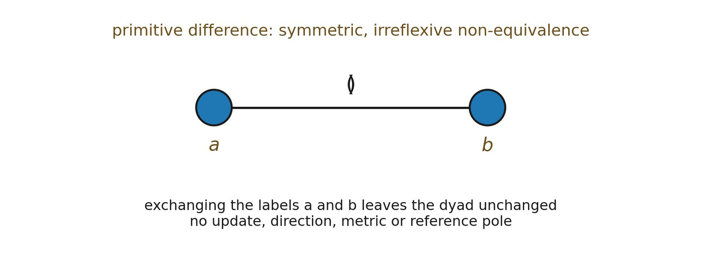

# 2.7 Exchange Symmetry Is Descriptive

At the Difference level, exchanging the external labels a and b leaves the dyad unchanged. The swap is therefore an automorphism of the described structure.

▪ σ(a) = b, σ(b) = a, σ(𝔇) = 𝔇

This statement belongs to the theorist’s description. It says that the primitive structure has no fact corresponding to “which pole is really a.” It does not yet say that the modeled structure can perform, instantiate, or propagate the exchange. That difference will become the entire burden of Chapter 3.

*Figure 2.3. Primitive Difference is symmetric non-equivalence. Exchanging the*

*metalanguage labels leaves the dyad unchanged. The figure deliberately contains no update arrow, privileged pole, metric, or temporal order.*
