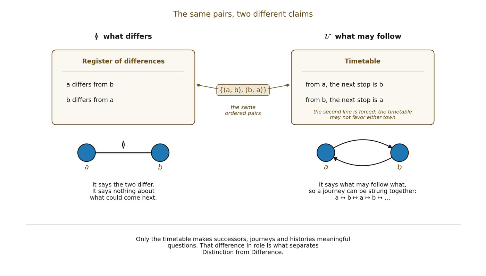

# 3.6 Proposition 3A: Reciprocal Distinction

Proposition 3A - reciprocal distinction. A primitive Difference becomes an operative Distinction when the dyad’s poles are promoted to a minimal configuration carrier and a nontrivial admissible transition relation 𝒰, invariant under Aut(𝔇), licenses succession between them. At the two-pole minimum, covariance forces reciprocal exchange without privileging either pole.

In plain terms: once one pole may be followed by the other at all, and no rule may favor either pole, each must be able to follow the other.

▪ 𝒰min = {(a, b), (b, a)}

The relation is deterministic at this minimum: each configuration has one admissible successor. It contains no primitive self-transition. Reciprocity is therefore a consequence of nontriviality plus symmetry, not an independently stipulated operation.

*Figure 3.1. The same pairs, two different claims. A register of differences and a*

*timetable can list the very same ordered pairs, but only the timetable says what may follow what, so only it lets a journey be strung together. A timetable that may not favor either town must also pair every service with its return: one non-trivial transition, plus symmetry, forces reciprocal exchange.* ≬*constrains what differs;* 𝒰 *constrains what may follow.*
