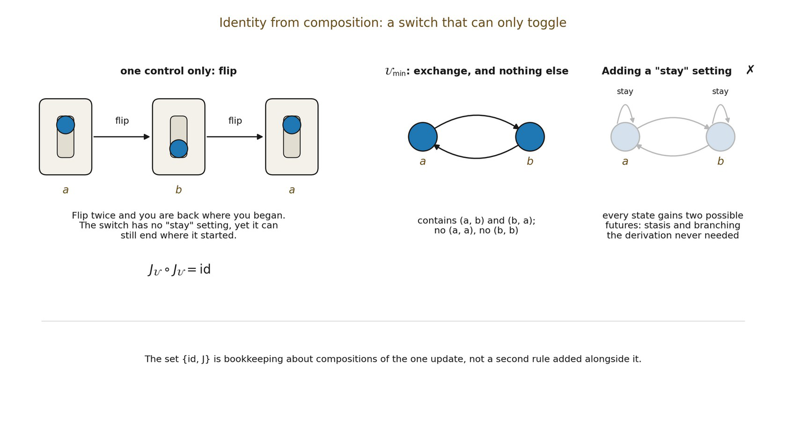

# 3.9 Identity Comes From Composition, Not Primitive Stasis

Applying the derived reciprocal map twice returns the same configuration:

▪ J𝒰² = id

The identity map id is therefore generated by composition. It is not a primitive self-loop in 𝒰min. The update relation itself contains neither (a,a) nor (b,b). This matters because adding those pairs would introduce optional stasis and branching at the minimum without any derivational need.

The algebra generated by J𝒰 contains {id, J𝒰}, but that closure is derived bookkeeping over compositions of the primitive update.

*Figure 3.2. Identity from composition. A switch with a single control, flip, returns to*

*where it started after two flips, though it has no “stay” setting. The minimal update likewise contains exchange and nothing else; identity arises from composing it twice. Adding a “stay” transition would give every state two possible futures, which the derivation does not need.*
