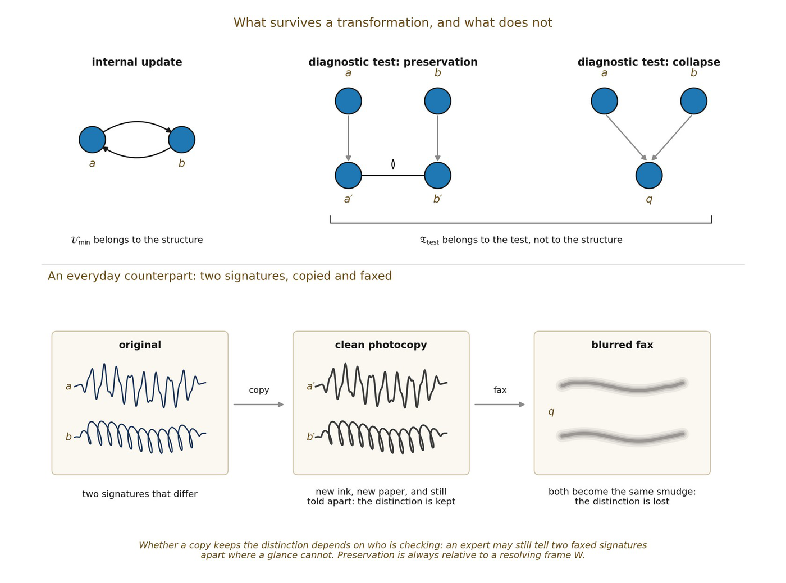

# 4.8 Preservation Can Change the Realization

Retention does not require T(a)=a or T(b)=b. Let Tp carry the poles to new realizations a′ and b′. If W can still resolve their non-equivalence, PresW(a,b;Tp) holds:

▪ Tp(a)=a′ Tp(b)=b′ a′ ≁W b′

The retained content is therefore relational rather than token-identical. Realizations may change while a criterion of distinction remains recoverable.

*Figure 4.1. What survives a transformation, and what does not. The internal update*

*belongs to the structure; diagnostic tests belong to the robustness test. A preserving test carries the poles to new realizations that remain distinguishable; a collapsing test sends both to one image. Two signatures behave the same way: a clean photocopy changes the ink and paper but keeps them distinguishable, while a blurred fax removes the fine detail that told them apart and reduces both to the same smudge. Whether a copy preserves the difference depends on who is checking.*
