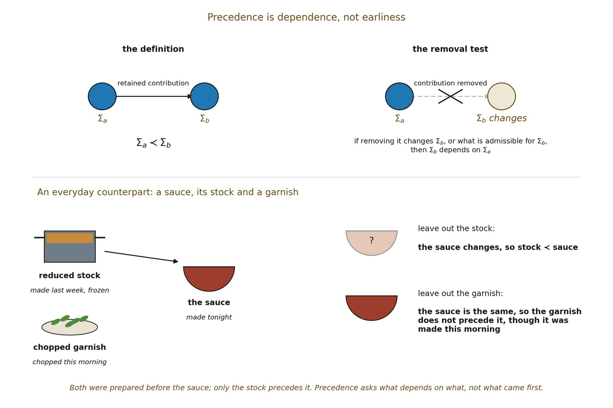

# 4.11 Retained-Dependency Precedence ≺

The conjunction of admissible succession and retention now yields something bare Difference cannot provide: dependency. Write

▪ Σa ≺ Σb

when Σb contains, or its admissibility depends on, a retained consequence inherited from Σa such that removing the relevant retained contribution changes Σb or changes the admissible possibility set leading to it. This is retained-dependency precedence.

The criterion is counterfactual rather than temporal. A useful schematic test is: if deleting the retained contribution from Σa changes 𝒫(Σb) or the admissibility of Σb, then the dependency is structurally consequential.

This directly discharges Chapter 3’s demand that 𝒰 do work that ≬ alone cannot do. Static non-equivalence cannot generate a successor possibility set or a retained-dependency relation. Admissible succession plus retained consequence can.

The symbol ≺ does not yet mean “earlier in physical time,” causal influence, or orientational direction. It is a generative/dependency ordering between configurations. Transitivity, acyclicity, and totality are not assumed here.

*Figure 4.2. Precedence is dependence, not earliness. Σ*a *precedes Σ*b *when removing*

*what Σ*a *contributed would change Σ*b *or what is admissible for it. The stock and the garnish were both prepared before the sauce, but leaving out the stock changes the sauce while leaving out the garnish does not, so only the stock precedes it.*
