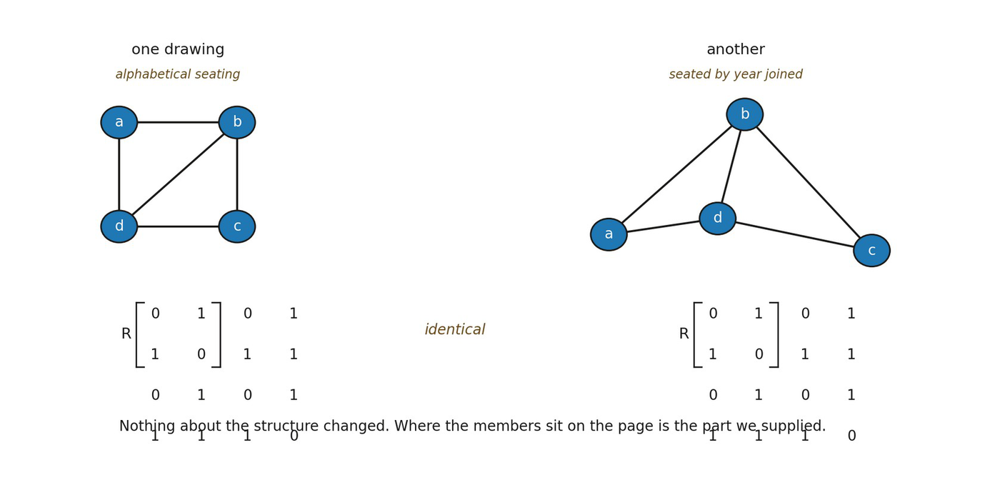

# 5.2 From Retained Distinction to the Relational Domain

Let rij be a retained distinction between two relational positions qi and qj, in the sense earned by Boundary. At this stage rij = rji in content unless a later chapter earns an asymmetry. A relational domain ℛ collects several such retained distinctions into one jointly describable organization. The matrix R is bookkeeping over those inherited relations, not a new ontological layer.

▪ R = \[rij\], ℛ = {qi, rij}

The entries of R are the already-retained relations of Boundary, not a new kind of relation. Capital R names the matrix, not a promotion of its entries. The matrix notation is bookkeeping and must not be mistaken for a spatial grid. Rows and columns are not directions, coordinates or locations. If the labels of the state-positions are permuted while every relation is preserved, the represented organization should remain the same. A relabeling changes the description without changing the structure.

▪ R ↦ R^π, with (R^π)ij = rπ(i)π(j)

Here π is a relabeling, a permutation of the relational positions. The plain predicate M used later for membership is kept distinct from the calligraphic possibility function 𝒫 inherited from Boundary. The requirement is not that this matrix form be fundamental. It is that the ontology remain invariant under mere renaming. If changing qi to qk changed the theory while preserving every relation, the labels would be carrying unexplained intrinsic content. Klein’s Erlangen programme (1872) provides a precise mathematical ancestor for invariance under transformation; here the same discipline is applied one level below geometry. The hole-argument literature in the philosophy of relativity (Earman and Norton, 1987) poses a closely related question about what survives descriptive relabeling.

The symmetry inherited from Boundary is preserved: rij and rji carry the same retained content. Retained-dependency precedence ≺ may order configurations by inherited consequence, but it does not by itself orient the internal roles of rij. Directed relational roles are reserved for Orientation unless an asymmetry is derived rather than stipulated.

▪ Multiple retained distinctions can be represented jointly without assigning them spatial positions, distances or directions. Open question: how networks of retained-dependency precedence ≺ constrain a domain while the retained relations themselves remain unoriented.

*Figure 5.1. The same structure drawn twice. Four members and five relations, laid*

*out once in one arrangement and once in another, with the adjacency matrix printed beneath each. The matrices are identical. The everyday counterpart is a league table sorted alphabetically and then by the year each club joined: the same league, rearranged. The insight is what the figure quietly withholds — nothing about the structure changed between the panels, so whatever differs between them is something the drawing supplied rather than something the relations contain. That is the invariance the chapter requires before relations can be called structure.*
