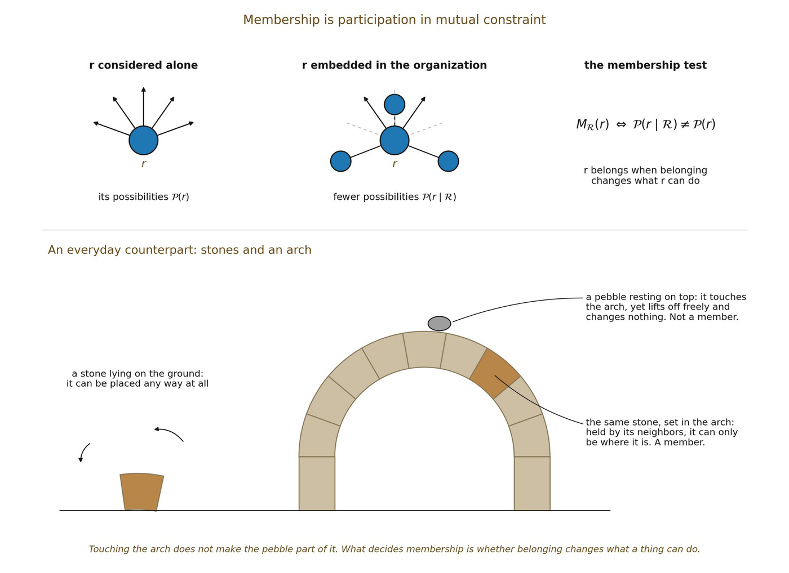

# 5.12 Higher-Order Membership in a Multi-Relation Domain

Boundary supplied a non-spatial preservation criterion and an identity scaffold, but it did not supply a primitive multi-relation aggregation operator. Relation therefore asks a narrower question: when should a retained relation count as participating in the organization ℛ? The answer should be stated from mutual constraint already earned here rather than by adding a new 𝒜.

▪ Mℛ(r) holds when participation of r changes the admissible organization of ℛ

The worked example of 5.16 supplies a non-agential case. A relation participates in the integrated structure when embedding it in ℛ changes admissible possibilities relative to considering it independently. A simple structural membership predicate is therefore Mℛ(r) iff 𝒫(r \| ℛ) ≠ 𝒫(r). No observer or privileged center decides membership. The predicate is fixed by the same mutual-constraint criterion used to distinguish structure from mere collection.

▪ Mℛ(r) ⟺ 𝒫(r \| ℛ) ≠ 𝒫(r)

A higher-order domain can then be described extensionally as the relations satisfying Mℛ, while its identity criterion F specifies which pattern of such participation is constitutive. Existential or universal statements about membership require only ordinary quantification in the metalanguage; they do not require a new modeled operator. Cardinal, majority, weighted, or threshold rules would require additional structure not yet earned.

Result. No independent aggregation primitive is required to state higher-order membership under one shared structural criterion. Membership is participation in mutual constraint; quantification over members remains metalanguage. This keeps 𝒰 typed as admissible succession rather than silently turning it into a Boolean accumulator or verdict-combining operation.

Cases in which different resolving frames classify the same organization differently are a separate problem. They concern reconciliation among frame-relative descriptions, not the constitutive membership criterion of ℛ. Relation therefore keeps W and F distinct: a frame may fail to resolve a constitutive difference, and a frame may resolve differences that do not matter to identity.

▪ Higher-order membership can be stated through mutual constraint and ordinary quantification without a new aggregation primitive. Cardinal, weighted, and threshold membership remain deferred until the required magnitude or valuation structure is earned.

*Figure 5.2. Membership is participation in mutual constraint. A relation belongs to*

*an organization when being embedded in it changes the relation’s admissible possibilities. A stone set in an arch can only be where it is, held by its neighbors; the same stone on the ground could lie any way at all. A pebble resting on the arch touches it but can be lifted off without changing anything, so it is not a member. The picture recalls Marco Polo’s answer to Kublai Khan in Calvino’s Invisible Cities\* (1974): the bridge is held up not by any one stone, but by the line of the arch the stones form.\**
