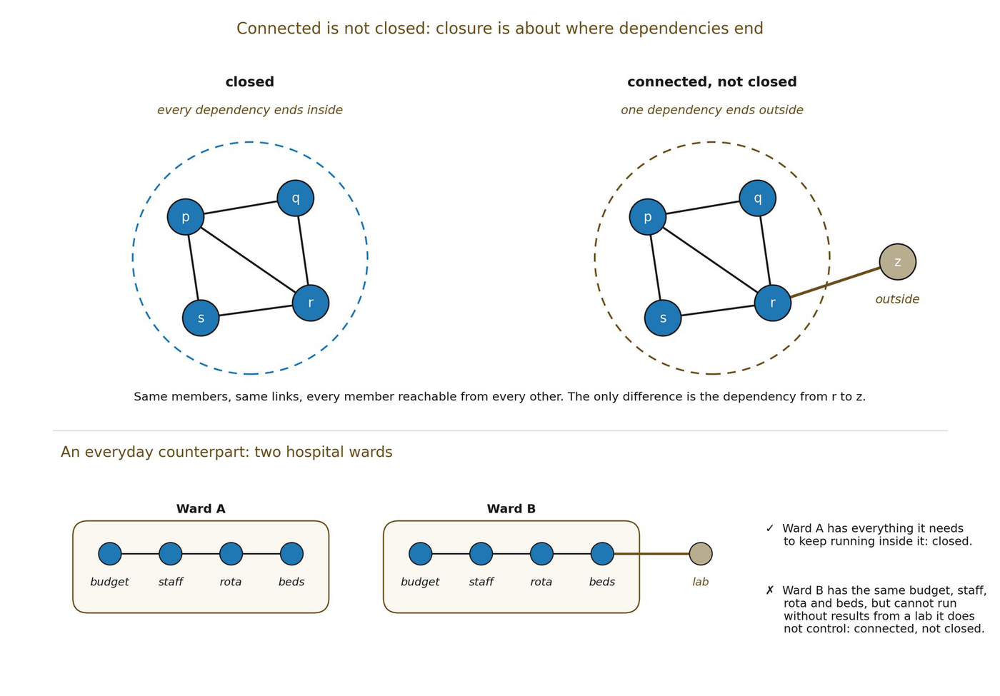

# 6.4 The Minimal Closure Test

A usable definition needs to distinguish genuine closure from connectivity, cycles and arbitrary observer-selected groupings. The test proposed here for structural closure has three parts. None is introduced as an independent primitive; each is a condition imposed on structures and machinery already available.

Internal sufficiency. Every dependency constitutively required to maintain F is supplied within the candidate domain, or else the domain is not closed with respect to F.

Constraint participation. The relations classified as constitutive of F must actually participate in the organization that maintains F. Merely listing unrelated retained relations inside the same set is insufficient. Participation is always judged at a declared resolution: a relation whose removal changes nothing a frame W can resolve has not thereby been shown to be idle, since its contribution may be derived through other relations or may lie below what W resolves.

Consistent realizability. The mutually constraining requirements must admit at least one relational configuration. Circular equations with no jointly admissible state do not constitute closure.

▪ ClosedF(ℛ) ⇒ SufficiencyF ∧ ParticipationF ∧ RealizabilityF

These three are conditions on a relational state. They define structural closure, which is a snapshot property. Persistence across change is a further and separate requirement. It is what distinguishes dynamic closure (6.7) and robust closure (6.8) from structural closure. It is the property the higher-order work of 6.12 actually needs. An instantaneous coincidence can be structurally closed without being able to do that work. The worked example of 6.18 keeps the two apart for that reason.

The implication is deliberately one-way. Formalism may later discover that some conditions are redundant, or that stronger necessary-and-sufficient conditions can replace them. Closure’s task is to expose the burden, not pretend the final theorem already exists.

▪ Connectivity and circularity are insufficient for closure. Open question: whether the three-part test can be reduced further, and whether each clause can be expressed using one common formal object in Formalism.

*Figure 6.1. Connected is not closed. Closure depends on where dependencies end,*

*not on how the members are linked.*
