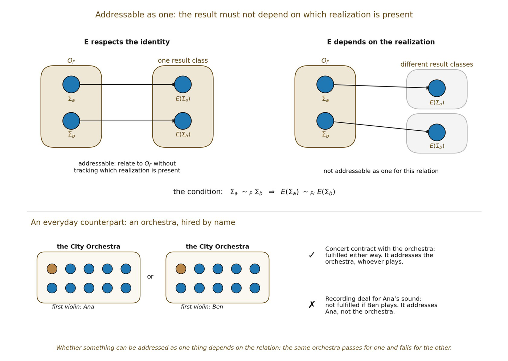

# 6.12 How Closure Creates Higher-Order Relational Addressability

The chapter’s most consequential claim is not merely that a network becomes self-contained. It is that a sufficiently stable closure can become a new relatum at a higher organizational level. That transition requires more than naming a cluster. It requires external relations to act consistently on the organization despite variation among its lower-order realizations.

Relation represented an object-like identity as an equivalence class of configurations that preserve an invariant F:

▪ OF = \[Σ\]~F

Let E denote some relation or transformation coupling this organization to a larger relational domain. E is well-defined at the higher-order level only if its result does not depend on which lower-order representative of OF happens to realize the organization. Formally, if

▪ Σa ~F Σb

then the higher-order action is well-defined when

▪ E(Σa) ~F′ E(Σb)

for the equivalence relevant to the resulting organization. When this condition holds, the larger domain can relate to OF without tracking every microconfiguration separately. We can define the higher-order action by representative:

▪ Ē(\[Σ\]~F) = \[E(Σ)\]~F′

because every representative yields the same higher-order result class.

This is the exact mechanism by which closure can grant higher-order addressability. The lower-order multiplicity does not disappear. It becomes irrelevant to a specified class of external relations because those relations factor through the invariant organization.

▪ many lower-order realizations ⇝ one stable higher-order relational address

The construction is analogous to a standard quotient construction in mathematics. An operation descends to equivalence classes only when it respects the equivalence relation. Here the analogy earns a precise criterion rather than merely a metaphor. The closest precedent in the study of dynamics is lumpability. A Markov chain is lumpable with respect to a partition of its states exactly when the coarse-grained process is itself well defined, whichever member of a block the system occupies (Kemeny and Snell, 1960). The condition above is the same demand made of a relation rather than a stochastic process.

At this prephysical stage it is safer to call this relational addressability rather than causal addressability. If later chapters derive physical causal structure, the same criterion may support a stronger causal reading.

*Figure 6.2. Addressable as one. A closed organization can be treated as a single*

*thing by a relation whose result does not depend on which lower-order realization is present. A concert contract with an orchestra is fulfilled whether Ana or Ben plays first violin, so it addresses the orchestra; a recording deal for Ana’s sound is not, so it addresses Ana. Addressability is always relative to the relation.*
