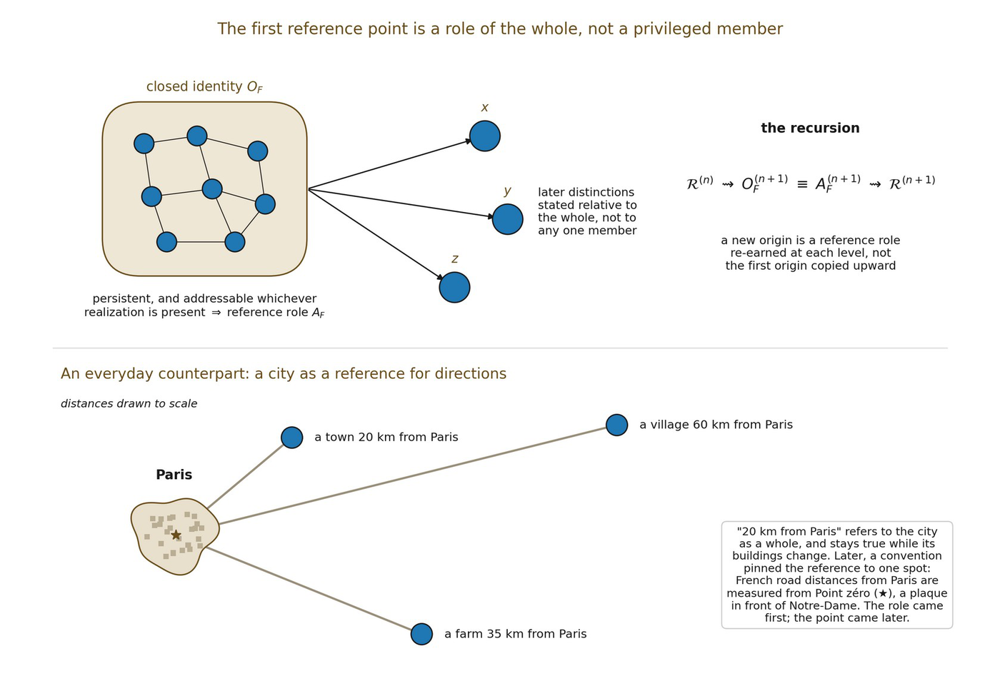

# 6.13 When Closure Earns Endogenous Reference

Boundary withheld an anchor because no privileged pole had been earned, and Relation produced integrated organization without selecting a center. Closure now supplies the first structure capable of functioning as a reference without importing one from Origin. A dynamically persistent closed identity OF = \[Σ\]~F becomes reference-capable when a declared class of higher-order relations acts consistently on OF across its lower-order realizations, as established by the addressability criterion of 6.12.

▪ ClosedF(ℛ) + dynamic persistence + representative-independent addressability ⇝ endogenous reference

Definition — organizational anchor. Write AF for a closed identity OF when it is functioning in this earned reference role: subsequent higher-order distinctions can be specified relative to OF without selecting an arbitrary lower-order representative. AF is therefore not an additional entity and not a privileged internal member. It names a role of the already-earned closed equivalence class.

This earns a minimal endogenous reference while preserving foundational symmetry. The reference belongs first to the organization as a whole. Some later structures may localize that role in a distinctive constituent; others may distribute it across several relations. Closure does not need to decide that stronger question in order to earn the weaker organizational anchor required downstream.

A new origin is therefore a re-instantiated reference role, not a transmitted primitive center. Once AF can enter further relational construction as one addressable relatum, a new organizational level may begin: ℛ^(n) ⇝ OF^(n+1) ≡ AF^(n+1) ⇝ ℛ^(n+1). The superscripts mark organizational level, not spatial scale or elapsed time.

▪ Closure plus dynamically preserved identity and representative-independent higher-order addressability is sufficient to earn an organizational reference role without privileging a primitive pole. Whether every closed organization yields a unique anchor, and what additional conditions localize or distribute that reference architecture, remains a problem for later formal development.

*Figure 6.3. The first reference point is a role of the whole. A closed identity that*

*persists, and can be addressed whichever realization is present, can serve as the reference for what comes next. “20 km from Paris” refers to the city as a whole, not to any building, and stays true while buildings change; only later did a convention pin French road distances to Point zéro, a plaque in front of Notre-Dame.*
