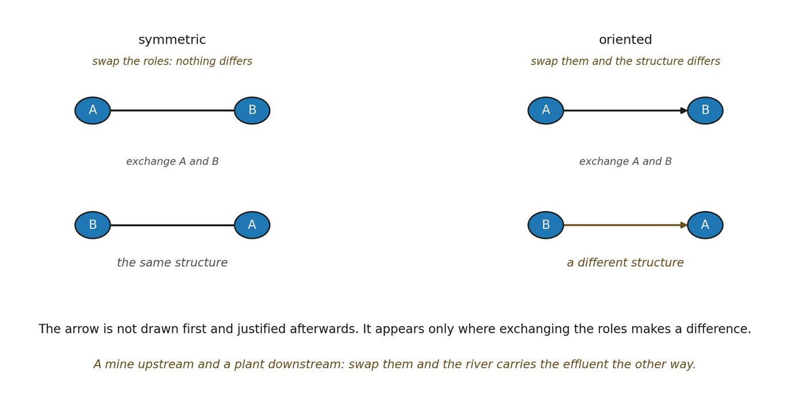

# 7.2 Orientation as a Derived Relational Property

The central proposal is that orientation should not be introduced by stipulating a directed edge. A directed edge is a convenient encoding only after the relevant asymmetry has been earned. The ontology should instead begin from the possibility constraints and dependency relations already available from Boundary through Relation.

Let Kij denote, schematically, the way admissible variation in relational component ri constrains the admissible variation of rj. The symbol imposes no metric, probability or causal force. It records a structural dependency, that changing what is admissible for ri changes what remains admissible for rj. ▪ Kij : Δri ↦ Δ𝒫(rj)

If the two roles are exchange-equivalent, reversal changes only labels. If they are not exchange-equivalent, the organization itself distinguishes them:

▪ Kij ≁ Kji

Working definition. A relational domain is oriented wherever its internal dependency structure contains persistent, consequential non-equivalence between otherwise exchangeable relational roles.

The local arrow discipline is explicit. Here ↦ denotes a map or coupling between a variation and a change in admissible possibilities; it is not retained precedence. The inherited symbol ≺ continues to denote retained dependency between configurations. Once asymmetric dependency has been earned, ≺ₒ denotes orientational dependency. No additional primitive directed-edge relation is introduced.

▪ Directional notation records an established non-equivalence; it does not create one. Open question: the weakest non-circular definition of Kij that avoids presupposing causality, probability, metric, or time (Question 1).

*Figure 7.1. The exchange test, and where the arrow comes from. In the upper panel*

*the relation between A and B is exchanged and the structure is the same one it was. In the lower panel the same exchange yields a different structure. The everyday counterpart is a mine upstream and a plant downstream: swap them and the river carries the effluent the other way. The insight is the chapter’s discipline about its own notation — the arrow is not drawn first and justified afterwards. It is admitted only where exchanging the roles makes a difference, which is what orientation means here and all it means.*
