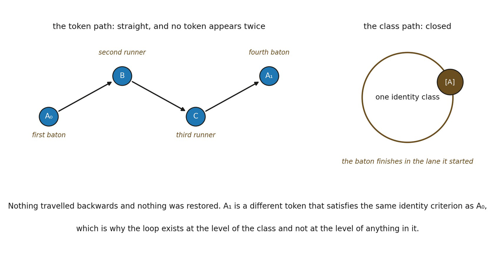

# 8.7 Type Return, Token Acyclicity and the Causal-Set Comparison

Suppose the dependency relation is strict. If the same state token A occurs both before and after B, one risks writing a literal cycle into an order that may have been defined to be acyclic:

▪ A ≺ B ≺ C ≺ A

A safer building is:

▪ A₀ ≺ B ≺ C ≺ A₁, where A₀ ~F A₁ but A₀ ≠ A₁

The sequence has returned to the identity type referenced by AF without returning to the identical state token. Ordinary language blurs this: “the system returned to A” can mean that a later state occupies OF, not that one and the same event has appeared twice.

This matters when comparing the framework with causal-set theory. Causal sets are locally finite partial orders in which the order represents proto-causality. As a result, token-level causal cycles are excluded by the partial-order structure. Identity-class recurrence, by contrast, can be represented by distinct ordered elements sharing a higher-order structural role. The comparison is structural only: we have not derived physical causality (Surya, 2019).

▪ identity recurrence can coexist with event-token acyclicity

The distinction also prevents a later discussion of physical cycles from being conflated with closed timelike curves. A recurring organization need not imply that a causal event returns into its own antecedent chain.

*Figure 8.1. Return through a different token. On the left the token path runs A₀ to B*

*to C to A₁ and is perfectly straight: no token appears twice and nothing goes backwards. On the right the same history at the level of the identity class is a closed loop. The everyday counterpart is a relay: the baton finishes in the lane it started, and no runner runs twice. The insight is that the loop exists at the level of the class and at no level below it, so return requires neither restoration nor reversal — A₁ is a different token that satisfies the same identity criterion as A₀, which is the whole of what has recurred.*
