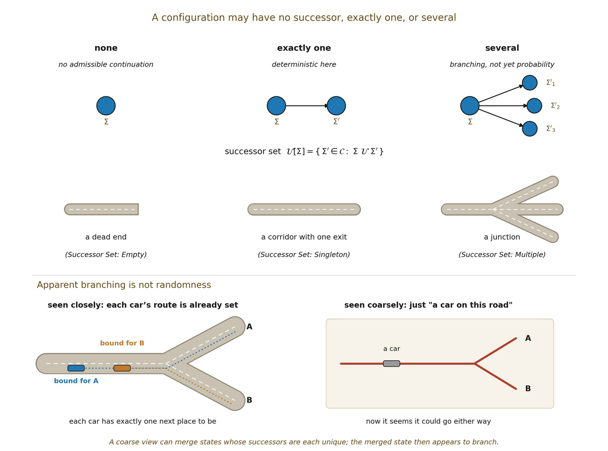

# 9.5 Admissible Transition Remains Relational

Distinction already typed 𝒰 as a relation rather than a function. Formalism now makes the consequence explicit at the general configuration level: no unique successor is implied unless uniqueness is separately earned. For a configuration Σ, define its successor set:

▪ 𝒰\[Σ\] = { Σ′ ∈ 𝒞 : Σ 𝒰 Σ′ }

Successor structure can therefore be characterized by quantification before Scale licenses internal cardinal magnitude. A configuration may have no admissible successor, exactly one, or several. Determinism is a property of 𝒰 on a specified domain, not part of 𝒰’s primitive type.

| **Successor set** | **Condition** | **Interpretation** |
| --- | --- | --- |
| Empty | No Σ′ satisfies Σ 𝒰 Σ′ | No admissible continuation under the present rule |
| Singleton | Exactly one Σ′ satisfies it | Deterministic continuation at this resolving level |
| Multiple | At least two distinct Σ′ satisfy it | Branching admissibility, not yet probability or randomness |

Where every admissible configuration has one and only one successor, the relation admits a functional representation on that domain. An external analyst may write \|𝒰\[Σ\]\| = 1 as bookkeeping; the modeled ontology need only state uniqueness by quantification. Branching is equally compatible with the relational type and introduces no probability measure by itself.

Branching does not imply stochasticity: no weights have been assigned. Nor does it establish metaphysical indeterminism. A coarse resolving frame may merge fine-grained states whose distinct successors remain unresolved. The same effective state can have several admissible successors even if a finer description is deterministic.

▪ effective branching ≠ fundamental randomness

What this preserves from Orientation. Orientation already treats 𝒰 relationally. Symmetry arguments must therefore distinguish two claims: covariance of the admissible successor relation, and selection of a particular successor trajectory. Equivariance can constrain the set 𝒰\[Σ\] without forcing one member to be selected. Orientation is carried by persistent consequential asymmetry, represented by ≺ₒ, not by assuming deterministic evolution.

▪ Determinism is a special case of admissible transition, not a presupposition of the notation. Open question: the exact conditions under which an F-equivalence supports well-defined quotient dynamics for branching transitions (Question 2).

*Figure 9.1. A configuration may have no successor, exactly one, or several;*

*determinism is the special case of exactly one. Roads show the three cases as a dead end, a corridor and a junction. Branching seen at a coarse resolution need not be randomness: each car approaching a fork already has its route, yet “a car on this road” could go either way.*
