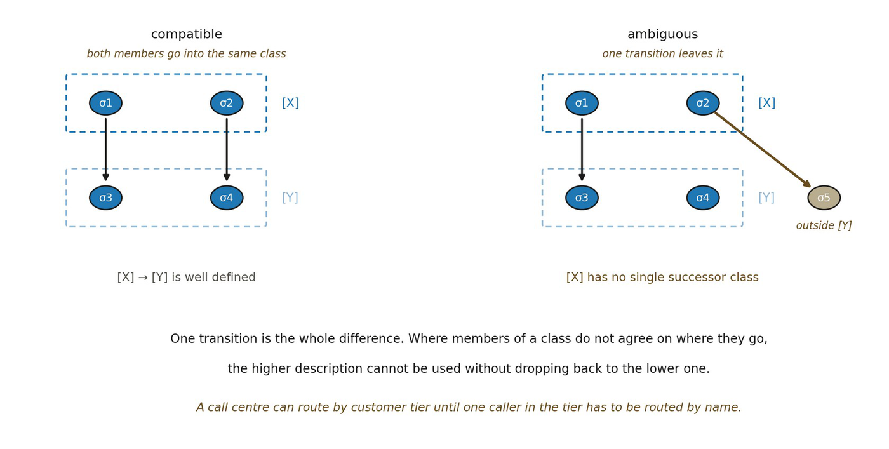

# 9.27 Worked Example: When a Macro-Identity Has Well-Defined Dynamics

A minimal example shows why equivalence alone is insufficient. Let 𝒞 = {a, b, c, d, e}. Let an identity criterion F give a ~F b and c ~F d, with e forming its own class. Write the quotient identities O1 = \[a\]~F, O2 = \[c\]~F and OE = \[e\]~F. Suppose the transition relation contains a 𝒰 c, b 𝒰 d, c 𝒰 e and d 𝒰 e. At the quotient level both representatives of O1 lead to O2, and both representatives of O2 lead to OE.

▪ A 𝒰̄ B 𝒰̄ E

The macro-dynamics is well defined even though a and b are distinct lower-order states. Now change one transition, so that a 𝒰 c and b 𝒰 e. Then a and b are still F-equivalent. However, their higher-order successors differ, since \[c\]~F = B and \[e\]~F = E with B ≠ E. The quotient update from A is now ambiguous unless the macro-rule explicitly allows both branches. A claim of deterministic higher-order dynamics would fail.

The example shows three things. An equivalence class can define a higher-order identity without yet defining higher-order dynamics. Transformation compatibility is the extra burden required for autonomous quotient dynamics. And determinism can differ by level: a deterministic micro-rule may become branching after coarse-graining. Branching micro-rules can collapse to one macro-successor when all branches land in the same class.

Return can be added by extending the example with e 𝒰 b. If O1 is dynamically closed and functions in an organizational reference role AF, the lower-order trajectory a 𝒰 c 𝒰 e 𝒰 b is not exact repetition, while the quotient trajectory O1 𝒰̄ O2 𝒰̄ OE 𝒰̄ O1 re-enters the identity class referenced by AF.

*Figure 9.2. Quotient compatibility, and the single transition that decides it. Two*

*states form the class \[X\] and two more form \[Y\]. On the left both members of \[X\] transition into \[Y\], so the higher-level transition from \[X\] to \[Y\] is well defined. On the right one member goes elsewhere, and \[X\] no longer has a single successor class. The everyday counterpart is a call centre routing by customer tier until one caller in that tier has to be routed by name. The insight is how little separates the two cases: one transition is the whole difference, and where the members of a class disagree about where they go, the higher description cannot be used without dropping back to the lower one.*
