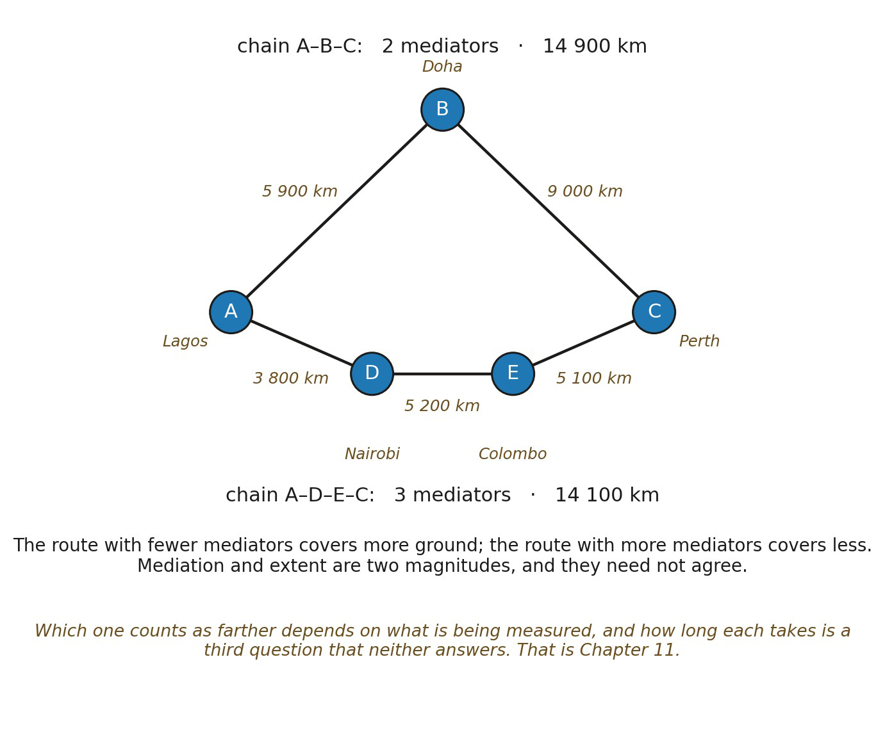

# 11.5 Why Not Every Chain Defines Distance

Between A and B, several admissible chains may exist. If all contributing relations are equivalent under s, one chain may carry magnitude 2u while another carries 3u.

Which one represents the separation between A and B? We cannot simply choose whichever route we prefer.

The natural candidate is the least sufficient relational mediation:

▪ du(A,B) = minκ ∈ K(A,B) Lu(κ)

where K(A,B) is the set of admissible relational chains connecting A and B.

The minimum is well defined only where that set is non-empty and finite. Finiteness comes from Scale, since the chains are compared by earned cardinal magnitude. Non-emptiness is a real condition rather than a technicality: two loci with no admissible chain between them have no distance at all, which is not the same as being infinitely far apart. That case returns in 11.15, where local metric structure fails to compose into a global geometry.

Distance is the smallest magnitude of relational mediation sufficient to connect two relational positions under the declared organization and scale standard.

The minimum is not yet a physical principle saying that systems move along shortest routes. Nothing moves. No action is minimized. The minimum selects the least relational structure necessary to mediate the two positions.

*Figure 11.1. Competing chains and minimum mediation. Two admissible relational*

*chains connect A to C. Under an unweighted standard in which each mediating relation belongs to the same magnitude class u, the upper chain carries 2u and the lower chain 3u, so the candidate distance d*u*(A,C) selects 2u as the least sufficient mediation. Each locus carries its everyday counterpart beside it, as an itinerary between cities, and each relation carries the distance flown. The two magnitudes disagree: the route with fewer mediators covers more ground, 14 900 km against 14 100 km, while the route with more mediators covers less. Counting mediators and measuring extent are different questions, and how long either journey takes is a third question that neither answers, which is what Time must earn.*
