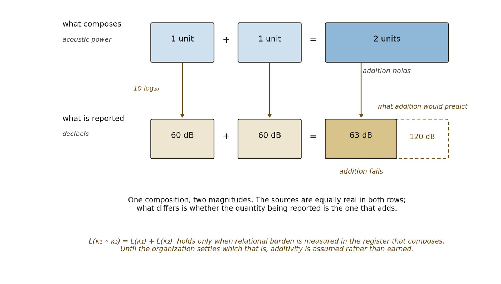

# 11.8 Additivity Must Be Earned

The weighted expression hides an assumption. If a chain contains two mediating relations with burdens a and b, why should the composite carry a+b?

Scale earned comparative magnitude and proportion. It did not prove that every magnitude composes additively.

If the organizational rule supports concatenation such that mediating burdens combine without interference, then:

▪ L(π₁ ∘ π₂) = L(π₁) + L(π₂)

If composition changes relational burden nonlinearly, then simple metric addition is not yet justified.

Metric distance requires a compositional magnitude law for relational mediation.

Addition is one candidate law. It is not primitive merely because familiar geometry uses it.

*Figure 11.2. Why additivity has to be earned. One composition is shown in two*

*registers. In the upper row the acoustic powers of two sources add: one unit and one unit make two, and the composite bar is the two source bars laid end to end. In the lower row the same event is reported in decibels, where 60 and 60 give about 63 rather than 120; the dashed outline marks what addition would have predicted. Neither row is wrong, and the sources are equally real in both. What differs is whether the quantity being reported is the one that composes. Relational burden faces the same question: L(κ₁ ∘ κ₂) = L(κ₁) + L(κ₂) holds only when burden is measured in the register that composes, so until the organization settles which register that is, additivity is assumed rather than earned and the triangle inequality of 11.10 inherits the assumption.*
