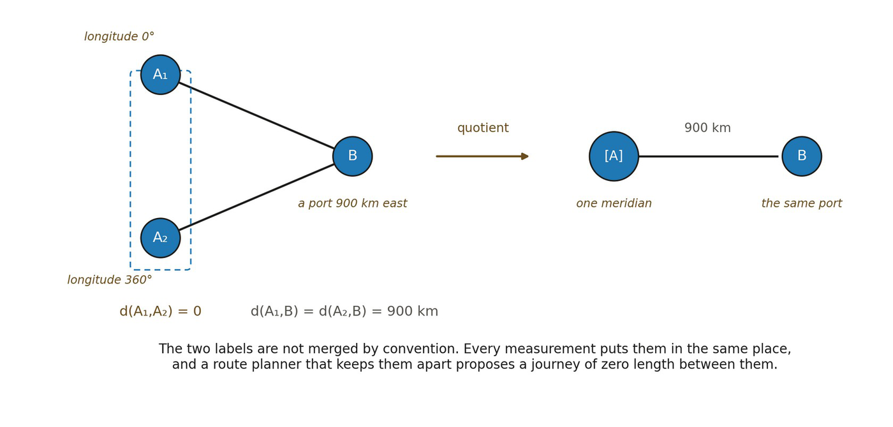

# 11.9 Zero Separation and Identity

A metric normally requires d(A,A)=0. No mediation is required to connect a relational position to itself under the identity relation.

The converse is harder. Suppose two lower-order configurations differ but every admissible relational comparison assigns zero separation between them.

Define:

▪ A ~₀ B iff d(A,B)=0

If ~₀ is a legitimate equivalence relation compatible with the organization, zero-separated states should be treated as one higher-order locus:

\[A\]~₀

The metric can then act on equivalence classes rather than lower-order representatives.

Metric identity may emerge by quotienting distinctions that carry no relational separation.

*Figure 11.3. Zero separation and quotient identity. A₁ and A₂ are distinct*

*descriptions that every admissible comparison assigns zero separation, so each stands in the same relation to every other locus: both are 900 km from B. The quotient treats them as one locus \[A\], and the metric acts on classes rather than on representatives. The everyday counterpart is longitude 0° and 360°, two labels naming one meridian. They are not merged by convention or for tidiness. Every measurement places them identically, and a route planner that keeps them apart will offer a journey of zero length between them, which is the signal that they were never two places. Metric identity can therefore emerge by quotienting distinctions that carry no relational separation.*
