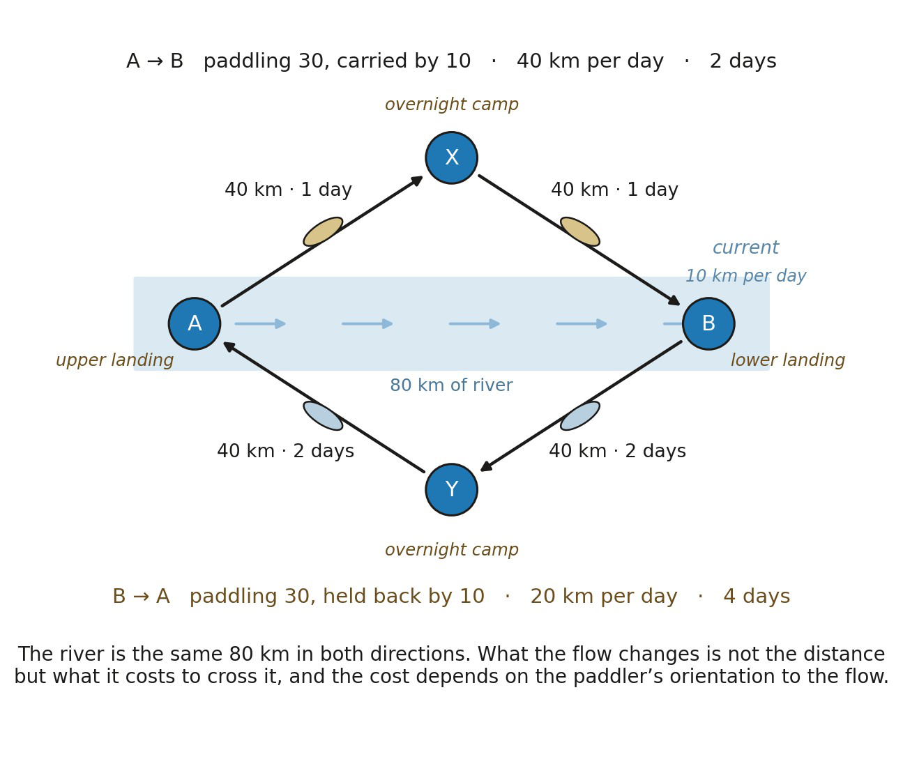

# 11.11 Symmetry Is Not Free

A conventional metric also requires:

▪ d(A,B)=d(B,A)

The framework cannot assume this. Orientation already earned consequential non-equivalence under role reversal. It is therefore possible that the admissible coupling A ↦ B requires different relational mediation from the reverse coupling B ↦ A.

▪ d(A,B) ≠ d(B,A)

The first structure Distance earns may therefore be a directed distance rather than a symmetric metric.

If every relevant mediating relation is reversibly equivalent under the distance criterion, and every admissible chain has a reverse chain of equal magnitude, symmetry follows.

▪ relational distance ⇝ directed metric-like structure ⇝ symmetric metric under reversible equivalence

*Figure 11.4. Orientation can produce asymmetric distance, read as a kayak on a*

*river. A is the upper landing and B the lower one, with 80 km of river between them; X and Y are the overnight camps, each 40 km from a landing. The band carries the current, running from A toward B at 10 km per day. The paddler makes 30 km per day in still water, so downstream the flow carries them at 40 km per day and each leg takes a day, giving the admissible coupling chain A ↦ X ↦ B a burden of 2. Upstream the same effort makes 20 km per day, each leg takes two days, and the chain B ↦ Y ↦ A carries 4. The river itself has not changed length, and neither landing has moved. What the flow changes is not the separation but what it costs to traverse, and the cost depends on the paddler’s orientation with respect to the flow. Where mediating relations are not reversibly equivalent in that sense, d(A,B) ≠ d(B,A), and the first structure Distance earns is a directed measure rather than a symmetric metric. Days and speeds are illustrative: duration and rate belong to Time, and the figure borrows them only to make the asymmetry visible.*
