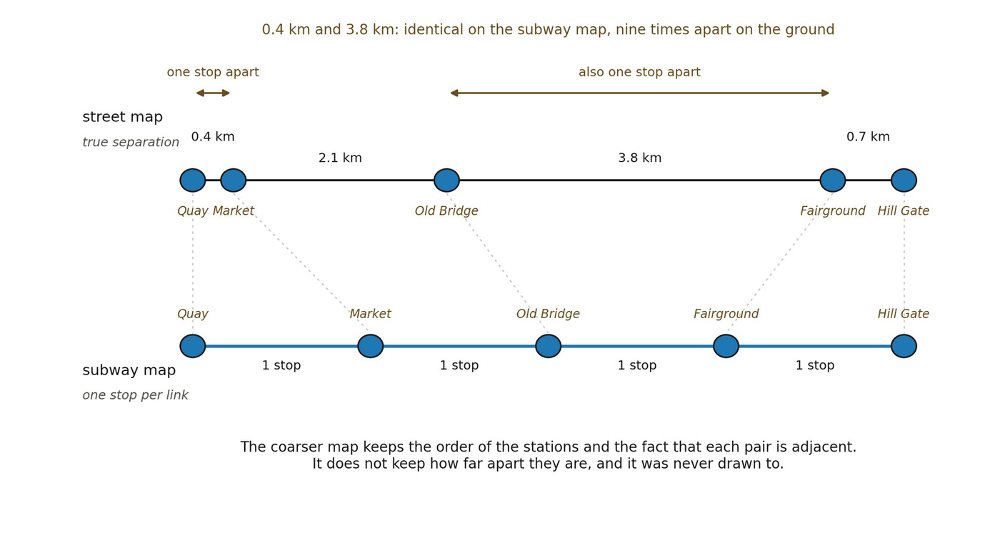

# 11.17 The Decomposition Problem Returns

Scale ended with a serious unresolved problem: magnitude depends on what counts as a member of the organization. Distance inherits the same vulnerability in amplified form.

A distance construction depends on what counts as a locus, what counts as a mediating relation, which chains are admissible, which distinctions receive nonzero weight, and which scale standard is applied.

If the analyst is free to choose these after seeing the desired result, almost any metric can be manufactured.

A relational distance is admissible only when its loci, mediating relations, admissible chains, and scale standard are independently constrained.

This may be the most important falsifiability condition in Distance.

Among competing decompositions that represent the same higher-order organization, a decomposition requiring fewer arbitrary relational commitments is preferable. The stronger result would be to show that the organization itself stabilizes some decomposition classes while alternatives fail under perturbation or coarse-graining. That remains open.

*Figure 11.5. Scale-relative distance under coarse-graining, read as a street map*

*against a subway map. The two rows carry the same five stations, and the grey ties mark which node is which across them. On the street map the separations are as they are on the ground: Quay to Market is 0.4 km, Old Bridge to Fairground is 3.8 km. On the subway map every link is one stop, so those two pairs are indistinguishable, though one is nine times the other. Analogous nodes therefore remain analogous under the coarse-graining, while their magnitudes do not survive it. The coarser description keeps the order of the stations and the fact that each pair is adjacent, and it was drawn to keep exactly that. This is why a scale-relative distance can be structurally objective inside its own regime and misleading outside it, and why 11.16 requires that a coarse-grained distance preserve the higher-order relations it claims to preserve, rather than all of them.*
