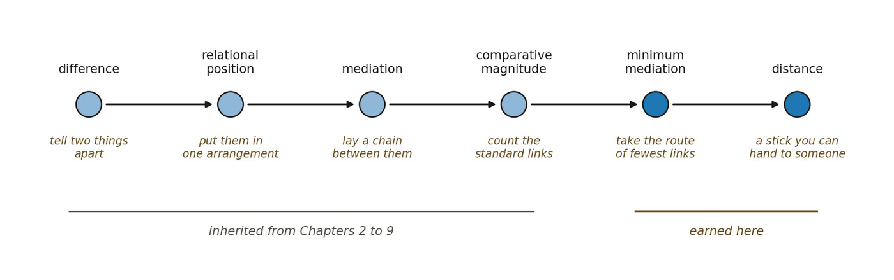

# 11.25 Implications and Handoff

Scale gave us magnitude without separation. Distance applies magnitude to relational mediation.

difference ⇝ relational position ⇝ mediation ⇝ comparative chain magnitude ⇝ minimum mediation ⇝ distance

Three results matter.

First, distance need not begin with coordinates. It can arise as an intrinsic comparison among relational positions.

Second, the metric axioms need not all be primitive. Non-negativity, zero-distance equivalence, and the triangle inequality can arise from lower-order structure under stated conditions. Symmetry requires an additional reversible equivalence and therefore remains conditional.

Third, distance inherits every weakness of the relational decomposition beneath it. A metric is endogenous only if the organization itself constrains the loci, relations, and standards from which the metric is built.

We can now say, in a limited relational sense: how far.

But a collection of distances is not yet a geometry. We can compare any two loci and say how far apart they stand. We cannot yet say that knowing some separations constrains what the others can be, that the loci near one of them stay near it through admissible transformation, or that the whole admits any number of independent ways of varying.

Distance is pairwise. Everything it gives us is a relation between two loci, taken one pair at a time.

▪ metric separation between loci ≠ organized constraint among separations

That gap is where the next chapter begins. Geometry asks when metric relations stop being merely pairwise and become mutually constraining: when neighborhoods persist, when overlaps limit what other distances can be, and when several independent modes of variation can be sustained at once. It is the same move the framework has made twice before. Retained distinctions became structure when they ceased to vary independently, and relations became organizations when their dependencies closed. Metric relations now face the same test.

Duration is a further question still, and a later one. A chain can carry magnitude without being traversed, and an order can hold without anything taking any length of time. Space must first say when geometric organization becomes physical extension, and only then can Time ask what gives ordered change a rate.

**Handoff to Geometry.** Distance gives magnitude to separation, one pair at a time. When do many separations constrain each other well enough to constitute a geometry?

Distance tells us how far two relational loci stand apart; Geometry must tell us when such separations organize.

*Separation can now have magnitude: how far two relational loci stand apart is set by their minimum admissible mediation burden.*

*Figure 11.6. Distance as a derivational bridge.*

Questions Opened by This Framework

Is minimum relational mediation the weakest adequate definition of distance?

Must relational distance be chain-based, or can pairwise relational invariants generate metric structure more directly?

Under what conditions is relational burden additive?

Can a useful generalized distance exist where additivity fails?

When does directed distance become symmetric?

Can zero-distance equivalence be constrained independently enough to support a legitimate quotient?

Which decomposition criteria keep distance from becoming analyst-dependent?

Can scale-relative distances converge toward a stable higher-order metric?

What coarse-grainings preserve minimum relational mediation?

Do generic relational systems produce coherent metrics, or is a stability-selection mechanism required?

Can independent relational modes later produce effective dimension without assuming orthogonality?

What additional structure turns a relational metric into geometry?

What would falsify the claim that distance has been derived rather than encoded?

Is minimum relational work merely an interpretive gloss, or can it eventually be formalized without importing physical energy?

Can the same minimality principle that selects relational distance help constrain the decomposition ambiguity inherited from Scale?

**Selected References Cited in Distance**

Bourbaki, N. (1966). *Elements of Mathematics: General Topology*, Part 1. Paris: Hermann; Reading, MA: Addison-Wesley. Translation of *Topologie générale*. For the standard metric axioms this chapter derives rather than assumes.

Dijkstra, E. W. (1959). A note on two problems in connexion with graphs. *Numerische Mathematik*, 1(1), 269–271. doi:10.1007/BF01386390. The shortest-path construction whose form the unweighted and weighted cases here reproduce.

Gromov, M. (1999). *Metric Structures for Riemannian and Non-Riemannian Spaces*. Progress in Mathematics 152. Boston: Birkhäuser. Translated by S. M. Bates from the 1981 French *Structures métriques pour les variétés riemanniennes*, with appendices by M. Katz, P. Pansu and S. Semmes. For metric structure developed without an ambient embedding, the mathematical neighbour of 11.14.

*Note on these references.* These are mathematical precedents and comparison classes, not evidence for the ontology. Bibliographic details were verified against primary or authoritative sources on 25 September 2026.
