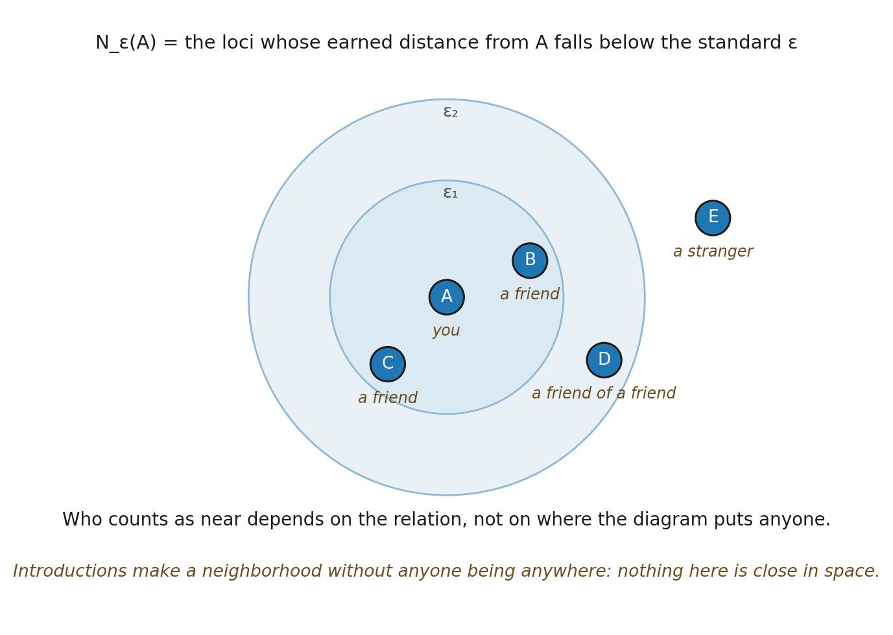

# 12.4 When Distances Become Neighborhoods

*Figure 12.1. From pairwise distance to stable neighborhood. Around the locus A,*

*two internally available standards ε₁ and ε₂ pick out the loci whose earned distance from A falls below them. The everyday counterpart is degrees of introduction: A is you, B and C are people you know, D is a friend of a friend who still falls inside the wider standard, and E is a stranger outside both. Membership follows from the relation rather than from where the diagram happens to put anyone, which is the whole content of the condition. The analogy is chosen for what it does not carry: a circle of acquaintance makes a neighborhood without anyone being anywhere, so nothing here is near in the sense Space has yet to earn. Its limit is that introductions are symmetric and these standards need not be, since Distance has already allowed d(A,B) ≠ d(B,A).*
