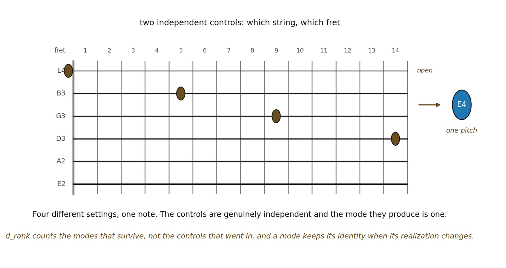

# 12.8 Coupled Layers and Collective Modes

*Figure 12.2. Coupled layers and collective modes, read as strings and frets on a*

*guitar. Which string and which fret are two independent controls, and the four marked settings — the first string open, the second at the fifth fret, the third at the ninth, the fourth at the fourteenth — all sound the same note. Read formally, the strings and frets are two coupled metric-relational layers, and the local degrees of freedom they carry between them leave fewer modes stable enough to be re- identified. The insight is double. Counting controls is not counting modes, which is why a layer is not a dimension; and the mode keeps its identity when its realization changes, which is the quotient identity of Formalism arriving in geometric dress. The analogy’s limit is that a guitar’s pitch is one-dimensional because a designer made it so, whereas here the question is whether the rank is fixed by the organization itself, which is what d*R *is meant to measure and 12.18 tests a second way.*
