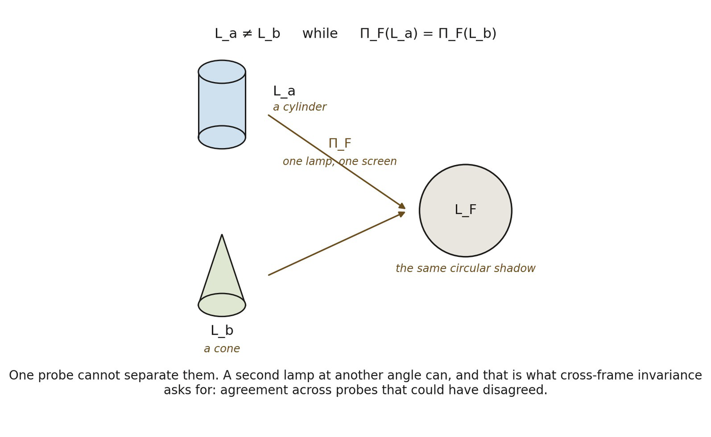

# 12.14 Stable Projection Does Not Uniquely Fix the Substrate

*Figure 12.3. One stable projection does not fix the substrate. Two different*

*organizations* 𝔏*ₐ and* 𝔏b *are resolved by the same frame into the same effective geometry, so* 𝔏*ₐ ≠* 𝔏b *while Π*F*(*𝔏*ₐ) = Π*F*(*𝔏b*). The everyday counterpart is a shadow: a cylinder and a cone, lit from one direction, can cast the same circle on the same screen. The insight is that a lossy resolution can be perfectly reliable for what it resolves and still leave the substrate underdetermined, which is why one probe proves little and cross-frame invariance asks for agreement among probes that could have disagreed. The limit of the analogy matters here more than elsewhere: there is no lamp and no screen. Probe, target and resolution are all internal to the same organization, as 12.16 insists.*
