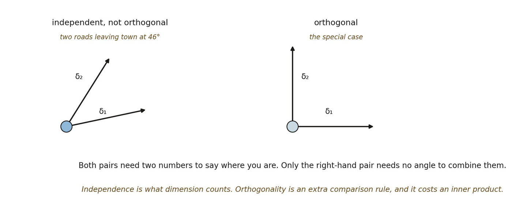

# 12.19 Independence Is Not Orthogonality

*Figure 12.4. Independence before orthogonality. On the left, two irreducible modes*

*δ₁ and δ₂ that are not perpendicular; on the right, the same two at a right angle. The everyday counterpart is two roads leaving a town at forty-six degrees: you still need both numbers to say where you are, and the roads are no less independent for meeting at an awkward angle. The insight is that dimension counts independent ways of varying, while orthogonality is a further comparison rule that costs an inner product the framework has not earned. The analogy’s limit is that roads already lie in a space with angles in it; here the angle is what has not yet arrived, and the left- hand case is the general one.*
