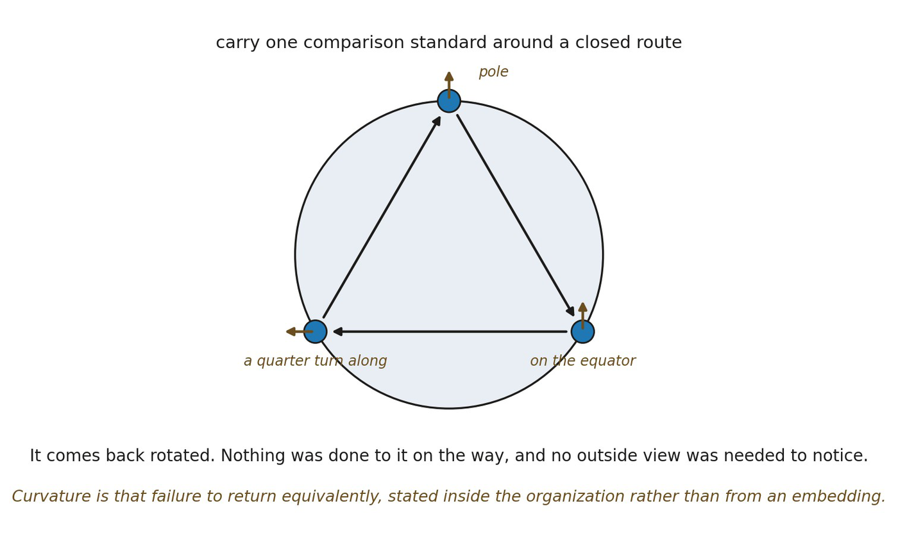

# 12.22 Curvature as Failed Return

*Figure 12.5. Curvature as failed return of a comparison standard. A standard is*

*carried around a closed route through overlapping neighborhoods and comes back rotated, though nothing was done to it along the way. The everyday counterpart is a walk on a globe: from the pole to the equator, a quarter turn along it, and back, keeping a stick pointed the same way at every step. The insight is that the failure is detectable from inside the organization and needs no outside view: curvature is a persistent failure of local standards to remain globally compatible, not a bend visible from an embedding. The analogy’s limit is that a globe is already a surface in space, whereas the relational statement asks only that transport around closed routes fail to return equivalently.*
