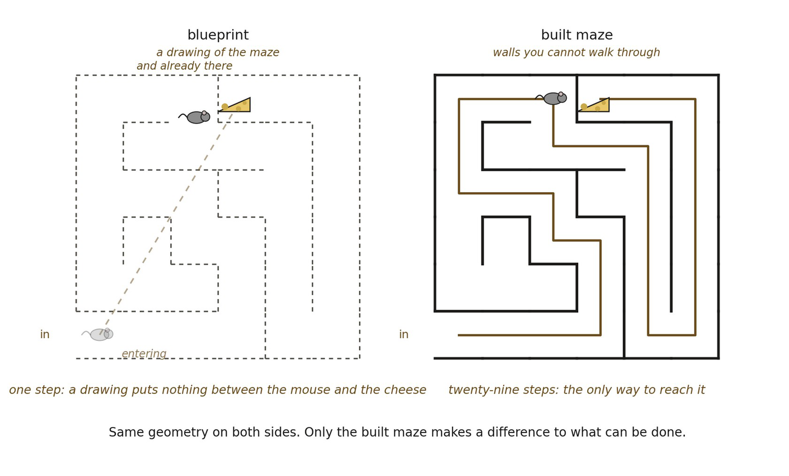

# 13.1 Geometry Can Exist Without Space

A geometry may possess metric relations, neighborhoods, dimensional rank, and transformations without thereby constituting physical space. A map has geometry. A graph may have metric structure. A mathematical manifold may have curvature. None of those facts alone establishes that its loci are places in which physically consequential relations occur.

▪ geometric locus ≠ spatial location

Geometry organizes separation. Space must make that organization consequential. This distinction prevents a familiar intuition from doing hidden explanatory work. Once a diagram contains points, lines, and distances, it is easy to imagine those points as already located somewhere. But the diagram is a representation available to us. The ontology has not yet earned what the diagram depicts.

The problem is therefore not to place geometry inside space. It is to determine when geometry itself deserves the interpretation space.

*Figure 13.1. A mouse can traverse a maze blueprint in one step to find the cheese,*

*and needs twenty-nine steps to reach the same cheese in a maze built from that blueprint. Both panels carry the same maze: the same cells, the same walls, the same entrance at the lower left and the same cheese. The geometry is identical and the difference is entirely in what it costs to do something, which is this chapter’s opening distinction: geometry organizes separation, and space makes the organization consequential. A wall is the familiar way to make a constraint visible, and constraint rather than masonry is what the figure is about: Matter arrives much later, and what makes the built case spatial is that the arrangement bears on what can be done.*
