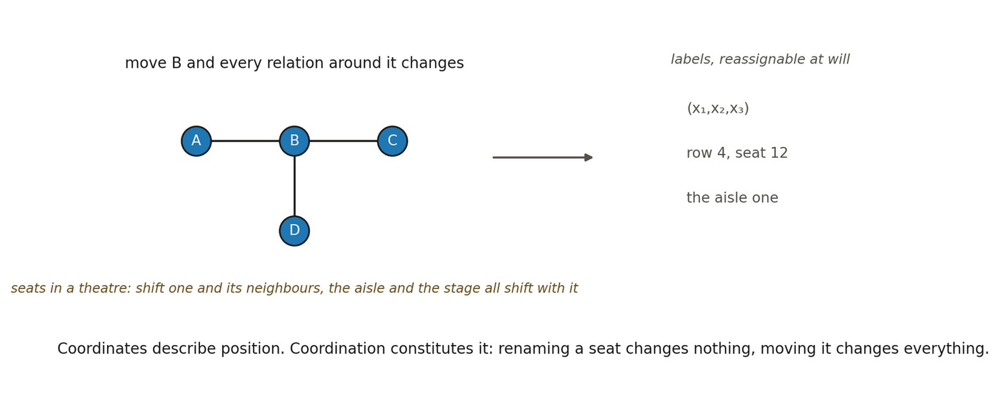

# 13.2 Coordination Is Not Coordinates

▪ coordination ≠ coordinates

Coordinates are representational labels assigned to an already-organized domain. For example, (x1, x2, x3) may identify a geometric position once sufficient structure exists to support such a representation.

Coordination means something deeper. Geometric loci are coordinated when their localization relations are mutually constrained such that changing the localization of one locus changes some larger pattern of relations by which that locus is situated relative to others.

Suppose A, B, and C belong to one geometric organization. Then changing A’s localization may alter d(A,B), d(A,C), its neighborhood membership N(A), and the relational pathways through which A can couple to the surrounding domain. The essential condition is therefore not that A has a numerical address. It is that A’s position has consequences for the rest of the organization.

coordinates describe position; coordination constitutes mutual position

*Figure 13.2. Coordination is not coordinates. Move B and every relation around it*

*moves with it; rename B and nothing changes at all. The everyday counterpart is a theatre: shifting one seat alters its neighbours, the aisle and the view of the stage, while relabelling it row 4, seat 12 alters nothing. The insight is that coordinates describe position and coordination constitutes it, so a spatial position is a role in a mutually constraining organization rather than a label attached to a thing. The analogy’s limit is that a theatre is already built in space, whereas here the constraint among localizations is what space is made of.*
