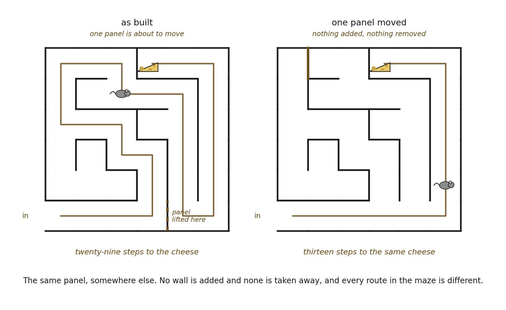

# 13.6 Localizations Constrain Localizations

This is the central conceptual step. Suppose A, B, C, and other loci are jointly resolvable. Their organization becomes spatially coordinated when the localization of one cannot be varied freely without changing the relational localization structure around it.

▪ Δ L(A) ↦ Δ { d(A,B), d(A,C), N(A), … }

The precise formal criterion remains to be developed, but the conceptual requirement is clear: spatial localizations are not independently assignable.

This repeats a pattern that appeared much earlier in the derivation. Relation became structurally significant when relations constrained relations. Geometry became significant when distances constrained distances. Space now appears when localizations constrain localizations.

▪ relations constrain relations ⇝ distances constrain distances ⇝ localizations constrain localizations

That recursion is not decorative. It identifies the new organizational level. A point has become a place only when its placement belongs to a larger mutually constraining organization.

*Figure 13.3. Localizations constrain localizations, read as one panel moved. The*

*maze on the left is the one built in Figure 13.1, and the route to the cheese runs twenty-nine steps. On the right a single panel has been lifted from one place and set down in another: nothing is added, nothing is removed, and the same cheese is now thirteen steps away. The insight is that no localization in a coordinated organization can be varied on its own. Change where one element sits and the distances, the neighborhoods and the available routes among all the others change with it, which is what distinguishes spatial coordination from mere geometric coherence.*
