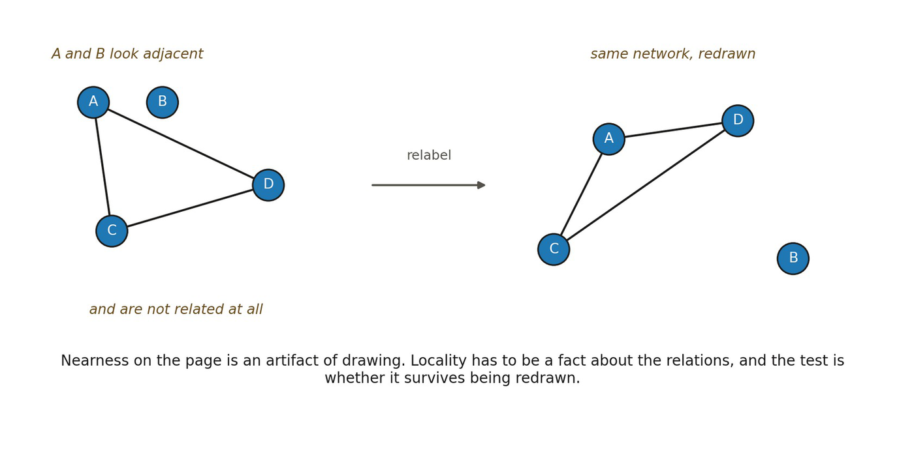

# 13.10 An Edge Is Not a Spatial Neighbor

▪ edge ≠ spatial adjacency

Primitive incidence may represent dependency, constraint, transformation, correspondence, or some other relation. It becomes spatial adjacency only after several additional conditions are satisfied.

▪ incidence ⇝ metric neighborhood ⇝ stable coordination ⇝ consequential locality ⇝ spatial adjacency

A candidate adjacency relation should survive relevant coarse-graining, coordinate removal, heterogeneous probing, perturbations that do not destroy the higher-order regime, and independent tests of relational accessibility. Otherwise spatiality may have been encoded in the representation rather than generated by the system.

*Figure 13.4. Page adjacency is not locality. On the left, A and B sit beside each other*

*and share no relation; on the right the same network is redrawn and the genuinely related pairs stay related. The everyday counterpart is any network diagram, where what looks close is an artifact of the drawing. The insight is the test rather than the picture: locality must survive redrawing, the same invariance Relation applied to labels and Geometry applied to representations. The limit is that no drawing shows locality directly, only its stability under changes of layout.*
