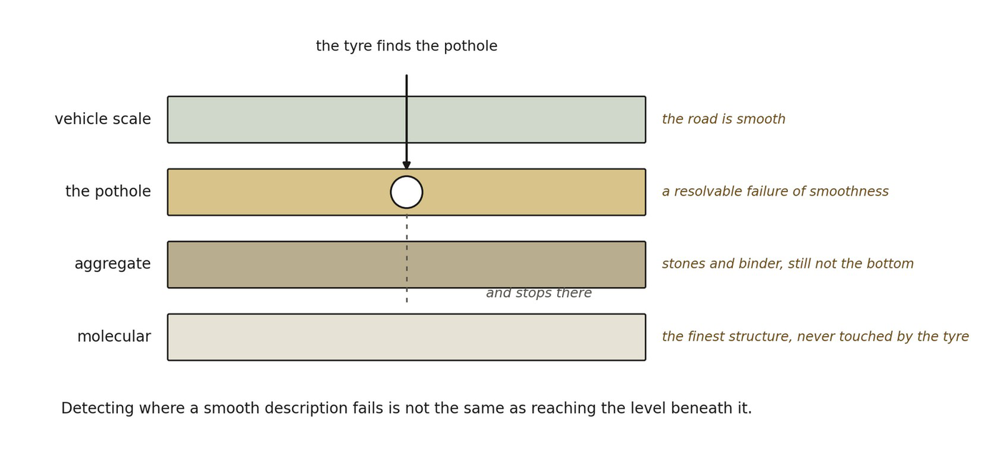

# 13.15 A Breakdown of Smoothness Is Not the Bottom Layer

Consider an ordinary road. At the scale of a vehicle, asphalt behaves approximately as a smooth surface. The tires need not resolve each grain of aggregate or the molecular structure of the binder in order to respond to the road’s curvature.

A pothole changes this. The vehicle now encounters a resolvable failure of the smooth-road approximation. But encountering the pothole does not suddenly reveal the molecular structure of asphalt.

▪ detecting non-smoothness ≠ resolving fundamental structure

The same possibility must remain open for effective geometry. A failure of smoothness at one scale may expose only an intermediate organizational regime.

▪ fine relational distinctions ⇝ local geometric microstructure ⇝ mesoscopic irregularity ⇝ smooth effective space

A probe may therefore encounter a geometric analogue of a pothole without reaching the finest relational distinctions from which the geometry ultimately derives.

▪ failure of one coarse-graining ≠ access to ontology’s terminal level

*Figure 13.5. Effective smoothness and what lies beneath it. Four levels of*

*organization, with a probe that reaches the second and stops. The everyday counterpart is a road: at the scale of a vehicle the asphalt is smooth, a pothole is a resolvable failure of that smoothness, and the tyre still never resolves the aggregate or the molecular structure below it. The insight governs how any evidence of granular geometry should be read: detecting where a smooth description fails is not the same as reaching the level beneath it, and the failure of one coarse-graining is not access to the terminal level of the ontology. The analogy’s limit is that a road has a known bottom, and the framework does not claim to know its own.*
