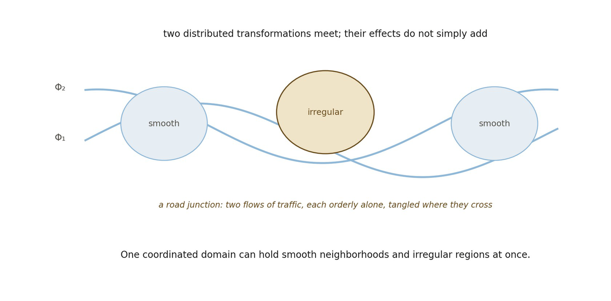

# 13.16 Spatial Coordination Can Be Responsive

Nothing in the definition of coordination requires the resulting spatial organization to be rigid. If the lower-order relational organization changes, the localization relations it supports may change with it.

▪ Geoₙ ↦ Geoₙ₊₁

A distributed relational transformation Φ might alter local couplings, Φ ↦ ΔKᵢⱼ, which in turn alter effective metric relations, ΔKᵢⱼ ↦ Δdᵢⱼ, and therefore neighborhood organization, Δdᵢⱼ ↦ ΔGeoₑff. The resulting geometry can then constrain subsequent relational transformation.

▪ Φ ↦ ΔGeoₑff ↦ ΔΦ′

relational transformation ↔ spatial coordination

This is a candidate proposition, not yet a derived dynamical law. It does not establish gravity. It does not establish quantum dynamics. It only prevents Space from being prematurely defined as an immutable stage on which later physical processes must occur.

Cao, Carroll, and Michalakis (2017) provide an interesting diagnostic comparison because perturbations of their underlying entanglement structure lead to changes in recovered spatial curvature. Their mechanism is specific to their Hilbert-space construction; the relevance here is only the broader possibility that effective geometry can respond to changes in deeper relational organization.

*Figure 13.6. Responsive coordination. A distributed relational transformation alters*

*couplings, which alter separations, which alter the effective geometry, and the altered geometry then constrains what the next transformation can do. The loop is the content: coordination need not be rigid, and a space that responds is still a space. The analogy is deliberately thin here, because the familiar case would be gravitation and that is precisely what the figure does not claim. It shows a candidate proposition to be modelled, not a dynamical law.*
