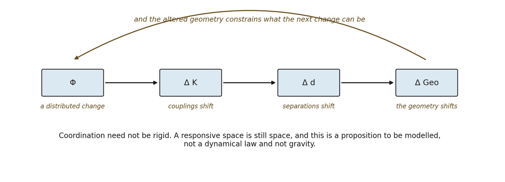

# 13.17 Smooth Neighborhoods and Irregular Regions Can Coexist

Effective smoothness need not be globally uniform. A single coordinated spatial domain can support locally smooth neighborhoods together with mesoscopically irregular transition regions.

Suppose several distributed relational transformations Φ1, Φ2, …, Φm intersect. If their effects on the underlying organization are nonlinear, then Δ G(Φ1 + Φ2) ≠ Δ G(Φ1) + Δ G(Φ2). Intersections can therefore generate organization not present in either transformation independently.

The word turbulent should remain analogical unless the mature dynamics exhibit genuinely turbulence-like properties such as nonlinear transfer across scales, characteristic spectra, cascade structure, or related mathematical signatures.

▪ intersecting transformations + nonlinear response ⇝ multiscale geometric irregularity

▪ irregular geometric response ≠ derived turbulence

*Figure 13.7. Smooth neighborhoods and an irregular region in one domain. Two*

*distributed transformations cross, and where they meet their effects do not simply add. The everyday counterpart is a junction where two orderly flows of traffic tangle while the roads either side stay orderly. The insight is that effective smoothness need not be uniform: one coordinated domain can hold smooth neighborhoods and mesoscopically irregular regions at once. The limit is the section’s own: turbulent remains an analogy until nonlinear transfer across scales, characteristic spectra or a dimensionless control parameter is actually derived.*
