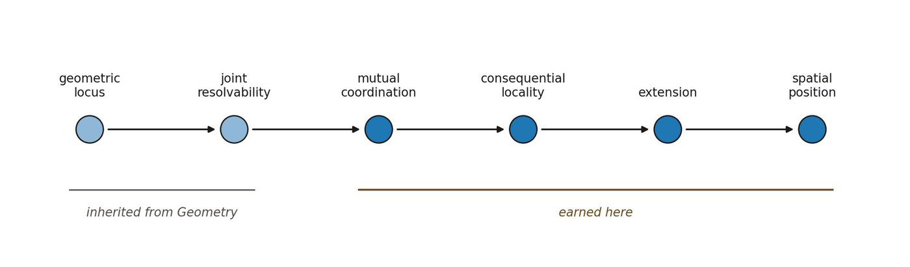

# 13.23 Candidate Formal Criterion for Space

Let an effective geometric organization be Geo = (X, d, N, K), where X is a family of recoverable loci, d represents inherited metric organization, N represents effective neighborhoods, and K represents admissible relational couplings. A candidate spatial regime S is present when the following conditions jointly hold:

| **Condition** | **Candidate requirement** |
| --- | --- |
| 1. Joint resolvability | There exist distinct loci A and B recoverable within one effective geometric configuration. |
| 2. Stable localization | Loc(A) and Loc(B) remain recoverable under admissible variation. |
| 3. Mutual coordination | Changing L(A) changes at least part of the surrounding localization relation structure. |
| 4. Non-collapsible extension | L(A) ≠ L(B), and collapsing them destroys a declared spatial invariant. |
| 5. Consequential locality | Geometric neighborhood constrains independently specified admissible coupling. |
| 6. Cross-frame robustness | Declared spatial invariants remain approximately stable across admissible heterogeneous probes. |

▪ Sp = a physically consequential coordinated localization structure

This remains a candidate definition until explicit generative models establish that these properties can arise without spatial locality being inserted into the lower-order rules.

*Figure 13.8. Space as a derivational bridge.*
