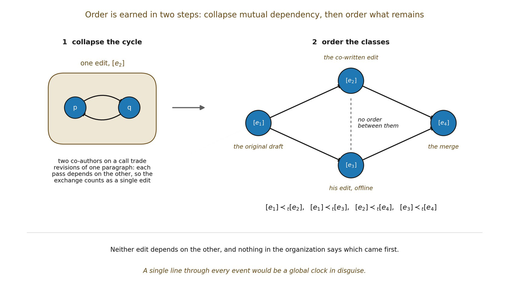

# 14.5 Earning a Partial Order from Weak Dependency

Ordinary narratives tempt us to imagine a single line of states: Σ₀, Σ₁, Σ₂, and so on. Boundary does not license that picture, and raw ≺ is not yet a partial order. The first task is therefore to separate directed dependency from mutually dependent cycles without imposing acyclicity by fiat.

Let 𝓔 be a set of resolvable relational events or update states and let ≺ be Boundary’s retained-dependency relation. Write ≺⁺ for non-empty reachability through one or more ≺ links. Define mutual dependency by:

▪ eᵢ ≈≺ eⱼ iff eᵢ ≺⁺ eⱼ and eⱼ ≺⁺ eᵢ

The equivalence classes \[e\]≈≺ collect events that belong to the same mutually dependent cycle. On the quotient 𝓔/≈≺ , define a strict candidate temporal precedence relation ≺ₜ by:

▪ \[eᵢ\] ≺ₜ \[eⱼ\] iff eᵢ ≺⁺ eⱼ and not(eⱼ ≺⁺ eᵢ)

This quotient construction does not assume that the original dependency graph is acyclic. It collapses each strongly mutually dependent component to one unresolved dependency unit; the remaining condensation relation is acyclic by construction.

The transitive reachability relation then supplies strict partial-order structure on the quotient: irreflexivity and asymmetry follow from excluding mutual reachability, transitivity follows from concatenating dependency chains, and incomparability remains possible between quotient events for which neither reachability relation holds.

A temporal interpretation is still not automatic. ≺ₜ is a structural order candidate. Time must additionally show that it is intrinsic, frame-coherent, and robust enough to organize admissible histories rather than merely classify a graph.

Incomparability is especially important. A universal total order would already resemble a hidden global clock. A strict partial order permits multiple locally ordered transformations without assuming that every pair has a meaningful global before-and-after relation.

*Figure 14.1. Order is earned in two steps. First, events that depend on each other in*

*a cycle are collapsed into one: two co-authors trading revisions of a paragraph produce a single edit. Then the resulting classes are ordered by dependency. Both edits build on the draft and the merge builds on both, yet neither edit depends on the other, so nothing orders them.*
