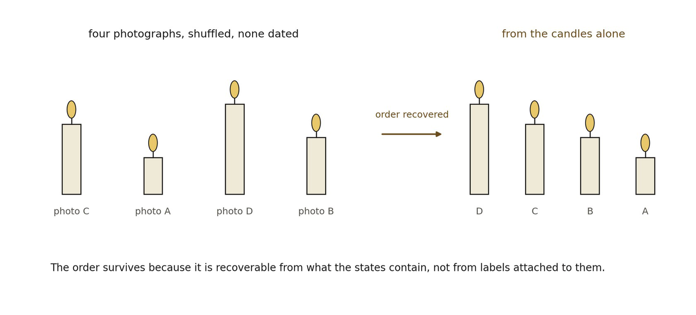

# 14.8 Derivation Order Is Not Physical Time

The framework itself was developed in an order: Distinction before Relation, Relation before Closure, and so on. That order cannot by itself ground physical time. A proof has premises before conclusions, but the paper containing the proof does not thereby generate a physical temporal field. The same caution applies to recursive construction.

A derivation can be represented by an acyclic graph of dependencies. To become physically interpretable as temporal order, the dependency must belong to the relational system being modeled, not merely to the theorist’s description of it.

This gives a simple diagnostic. If the ordering disappears when equation labels, program loop counters, or manuscript sequence are removed, then the model has not derived time. If the ordering can be reconstructed from the retained consequences encoded in the modeled states themselves, then it has at least earned an endogenous succession relation.

*Figure 14.2. The index-removal test, read as undated photographs. Four pictures of*

*the same candle, shuffled, with every timestamp stripped away. The order can still be recovered, because each state carries a consequence of the ones before it: the candle is shorter. The insight is the chapter’s sharpest criterion. If the ordering vanishes when iteration counters, equation labels and manuscript sequence are removed, the model has not derived temporal order; if it survives, the order belongs to the organization rather than to the notation describing it.*
