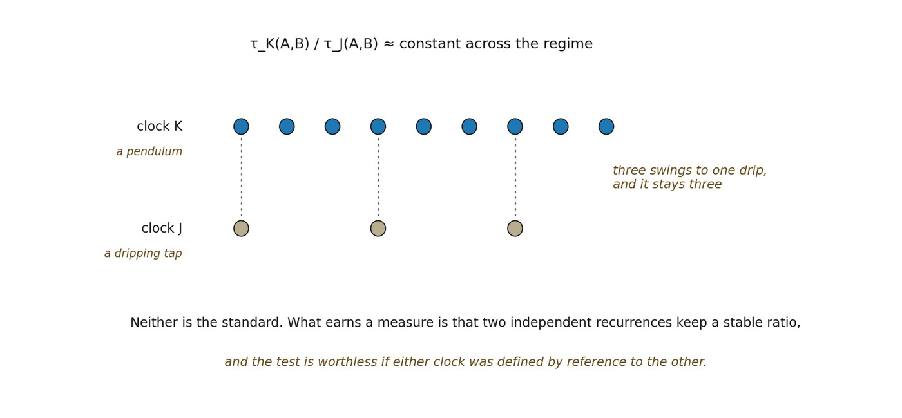

# 14.14 From Local Temporal Standards to Shared Metric Time

One recurrent subsystem gives a local standard. Physical time becomes more compelling when multiple independently realized clocks can be calibrated so that their comparative ratios remain stable under transformations relevant to the domain.

▪ τK(A,B) / τJ(A,B) ≈ constant over an admissible regime

This cross-clock invariance is stronger than recurrence. It suggests that a common temporal measure may be recoverable even though no primitive universal clock exists. The measure is then an invariant relation among recurrent processes, not a substance carried by one preferred oscillator.

However, the word “common” must be handled carefully. A shared temporal calibration within a local or weakly varying domain does not establish a global cosmic time. Nor does it establish relativistic proper time. The chapter earns at most a route by which metric temporal standards could become endogenous to organized relational dynamics.

*Figure 14.3. Cross-clock calibration, read as a pendulum and a dripping tap. Neither*

*is the standard. What earns a temporal measure is that two independently realized recurrences hold a stable ratio across a regime, so that τ*K*(A,B) / τ*J*(A,B) stays put whichever pair of events is compared. The insight is that a shared measure can be recovered without any primitive universal clock. The condition is easy to lose and the chapter states it at 14.13: the test is worthless if either clock was defined by reference to the other, since agreement would then have been built in rather than found.*
