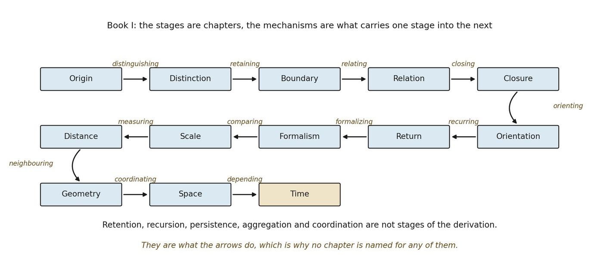

# 14.31 Book I Frontier: The Problem of Spacetime

Book I began by refusing to assume the structures it hoped to explain. Relation was not allowed to mean spatial adjacency. Recursion was not allowed to mean elapsed time. Orientation was not allowed to become a hidden axis. Geometry had to be earned before Space, and Space had to become physically consequential before locality could be claimed.

Time now closes the same discipline from the other side. Retained consequence can generate an order of transformation without requiring a universal clock. Recurrent relational processes can, conditionally, supply endogenous standards by which ordered transformation is compared. But the derivation stops before the decisive physical synthesis.

*Retained dependency can now yield an internal order once mutual-dependency cycles are collapsed, without an external clock.*

Space and Time now coexist as distinct achievements of the relational framework. Space organizes where relational states can be localized and how neighboring regions constrain one another. Time organizes how retained transformations can stand in ordered dependency and how recurrent processes might provide temporal standards. Physical reality, however, does not present these as two independent ledgers.

The next question is therefore unavoidable:

Under what conditions do spatial localization and temporal order become mutually constrained aspects of one physical spacetime structure?

Nothing in Book I licenses writing a Lorentzian interval by fiat. It has not earned the minus sign, null separation, invariant c, causal cones, Lorentz transformations, or a 3+1-dimensional spacetime regime. Nor has it established that spatial mediation and temporal update should be commensurable at all.

Those are no longer background assumptions. They are research targets.

*Figure 14.4. Book I as a whole. The fourteen chapters are the stages, and the*

*mechanisms that carry one stage into the next are written on the arrows: distinguishing, retaining, relating, closing, orienting, recurring, formalizing, comparing, measuring, neighboring, coordinating, and ordering. The arrangement makes the chapter’s inheritance visible, since retention and raw dependency are mechanisms established earlier and carried forward rather than renamed as temporal results. Book I ends only after Time has tested what additional structure is required to turn dependency into order.*

The frontier can be summarized as:

▪ retained distinction ⇝ relational organization ⇝ geometry ⇝ Space

▪ retained consequence ⇝ dependency ≺ ⇝ cycle quotient and coherent precedence ≺ₜ ⇝ Time

▪ Space + Time + unknown coupling constraints ⇝ ? ⇝ physical spacetime

Book II begins at the question mark. Its task is to test whether constrained extrapolations of the structures earned here can generate stable dimensionality, metric coupling, causal geometry, Lorentzian signature, and physical dynamics without those results being encoded in advance. If they can, the relational program has crossed from ontological possibility into a candidate account of physical instantiation. If they cannot, the failure identifies the boundary of the framework.

That is where Book I should end: not with spacetime assumed, but with spacetime made into a precise problem.

**Selected References Cited in Time**

Barbour, J. (1999). *The End of Time: The Next Revolution in Physics*. London: Weidenfeld & Nicolson; New York: Oxford University Press, 2000. The British edition carries the subtitle *The Next Revolution in Our Understanding of the Universe*. Used as a contrasting relational/timeless interpretation and as a reminder that temporal ordering and fundamental temporal substance are separable questions.

Bombelli, L., Lee, J., Meyer, D., & Sorkin, R. D. (1987). Space-time as a causal set. *Physical Review Letters*, 59(5), 521–524. doi:10.1103/PhysRevLett.59.521. See also the exchange with Moore, *Physical Review Letters*, 60 (1988), 655 and 656. Used as a comparison class for partial-order approaches in which causal order is fundamental and continuum spacetime is emergent.

Lamport, L. (1978). Time, clocks, and the ordering of events in a distributed system. *Communications of the ACM*, 21(7), 558–565. doi:10.1145/359545.359563. Used as a formal comparison showing how dependency can establish event order without one global clock; not used as evidence for fundamental physics.

Price, H. (1996). *Time’s Arrow and Archimedes’ Point: New Directions for the Physics of Time*. New York: Oxford University Press. The double standard fallacy of chapter 1 is the objection nearest to this chapter’s own index-removal test: an explanation of temporal asymmetry that assumes an asymmetry at the outset. Used for conceptual comparison on temporal asymmetry and the need to distinguish dynamical laws from arrows generated by boundary and statistical structure.

Rovelli, C. (2018). *The Order of Time*. Translated by E. Segre and S. Carnell. New York: Riverhead Books. Originally published as *L’ordine del tempo* (Milan: Adelphi, 2017). Used for conceptual comparison with relational and non-universal treatments of time in modern physics; not treated as a derivation of the present framework.
