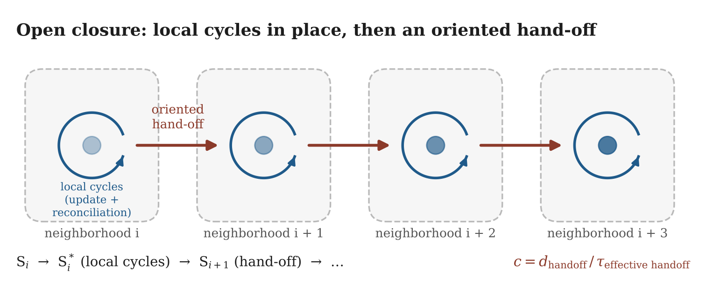

# 20.5 Open Closure: Update and Hand-off

What distinguishes a light-like excitation from the background of ongoing updating?

Two processes are needed, and the account depends on keeping them apart.

1.  **The local cycles.** The excitation's state must repeatedly return to a relational configuration close enough to the previous one to preserve its identity. This return completes the excitation state where it is. Local recursive cycling and spatial hand-off are distinct processes, so one local turn is not one spatial step. Our current candidate is that more than one local cycle occurs before each hand-off (◌): a transformation or update cycle completes the state and informs the neighboring relations; the neighbors return constraints; a reconciliation cycle resolves the completed state against those constraints; then the oriented hand-off follows. Each of these cycles takes time, so the local cycling is bounded, and its duration is part of what limits propagation (20.12).

2.  **The hand-off.** The completed state must be communicated to the neighboring region, so that the same organized pattern is re-instantiated there. This is propagation across space, and it is the process limited to the speed of light (20.12).

In sequence:

$$\text{transformation/update cycle} \rightarrow \text{neighbor informing} \rightarrow \text{returned constraints} \rightarrow \text{reconciliation cycle} \rightarrow \text{oriented hand-off}$$

Together they form an open closure:

$$\text{local recursive cycles} + \text{hand-off to the neighbor} = \text{open closure}$$

The word *closure* refers to the recurrent organization that preserves identity. The word *open* refers to the fact that the closure does not stay in one place: it completes locally, and its completed state continues into the next neighborhood.

A luminous excitation is therefore neither a small object carried intact through space nor an unstructured disturbance spreading without identity. It is a recursively maintained pattern whose continuation depends on successful re-instantiation.

**Figure 20.1.** Open closure. In each neighborhood the local cycles complete and reconcile the excitation state (curved arrows); the resolved state is then handed to the next neighborhood (straight arrows). The propagation speed is the hand-off distance divided by the full time the local cycles, reconciliation and transfer take. What travels is not a fixed object but a state re-instantiated neighborhood by neighborhood.

The capacity for such re-instantiation gives us a physical criterion:

$$\text{light-like persistence} = \text{continuous recovery of an identity-bearing open closure}$$
