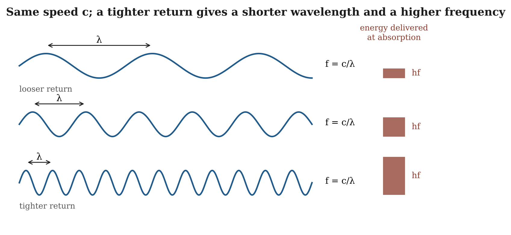

# 20.9 Energy, Frequency, Wavelength and Amplitude

The energy available to an excitation, together with the geometry of its source and the conditions of its surroundings, determines which coherent organizations can be sustained. Frequency, wavelength, amplitude and polarization are expressions of how that energy is geometrically organized within a stable propagating closure:

$$E \rightarrow \text{admissible closure geometry} \rightarrow \{ f,\lambda, A,\chi,\widehat{k},\ldots\}$$

Additional energy changes a propagating closure according to how it couples to the organization already sustaining it. Where the incoming contribution supports a given property, it reinforces that property's expression along the path. Where it opposes the property, it weakens, redirects or redistributes it into another admissible mode. The result depends on more than the amount of energy added:

$$\Delta P =  F\left( E_{\text{add}},\, C_{P} \right)$$

where $\Delta P$ is the change in a property P of the light, $E_{\text{add}}$ is the energy entering the interaction, $C_{P}$ is the compatibility of that energy with the organization sustaining P, and F is the rule relating them.

In one regime the added energy tightens the recursive return (◌). The tighter the return, the shorter the spacing between successive phases and the higher the frequency:

$$E \uparrow  \rightarrow \text{tighter recursive return} \rightarrow \lambda \downarrow  \rightarrow  f \uparrow$$

In another regime the closure keeps its class and the added energy increases the strength or breadth of coherent participation:

$$E \uparrow  \rightarrow \text{same recurrent class} \rightarrow  A \uparrow$$

The source and its surroundings determine which of these reorganizations are available. In the ordinary weak-field vacuum regime, overlapping light does not measurably change either beam's frequency; frequency changes are measured where light meets moving matter (Doppler shift), scatters from charge (Compton 1923) or climbs out of a gravitational well (Chapter 22).

**Figure 20.3.** Three excitations at the same speed c. A tighter recursive return shortens the distance between successive phases (the wavelength λ) and raises the frequency f, so that fλ = c in every case. When each is absorbed, the energy delivered is hf: the shortest wavelength delivers the most energy per absorption.

This dependency also clarifies why the measured relation E = hf matters. If frequency is a resultant property of recurrent geometry, the straight-line relation between delivered energy and frequency should say something fundamental about what it takes to maintain that recurrence. We return to that problem in 20.18.
