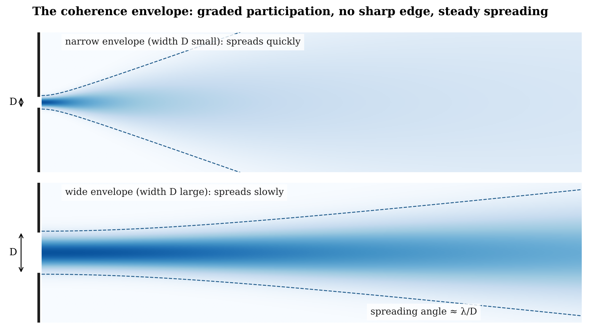

# 20.10 Wavelength, Local Update and the Coherence Envelope

Wavelength emerges from the ordered recurrence of many local updates. Each update contributes to the evolving geometry of the closure, while the wavelength is the larger distance over which the complete phase organization returns to an equivalent state:

$$\text{local update} \rightarrow \text{ordered sequence} \rightarrow \text{complete phase recurrence} \rightarrow \lambda$$

The scales involved can differ enormously. A local relational update may occur at a very fine structural scale, while the wavelength of visible light is 380 to 750 nm†. The observed wavelength belongs to the recurring organization of many updates, not to the size of one elementary relational event.

A propagating excitation can extend across many wavelengths, and the region taking part in its propagation can be larger still. We call that larger structure the coherence envelope:

$$\text{coherence envelope} = \text{graded region of neighboring relations taking part in the same propagating organization}$$

The envelope need not end at a sharp boundary. Participation can be strongest near the dominant path and fall off outward as compatibility falls. The excitation can therefore have a structured spatial profile without being a sharply bounded small object moving through space.

This graded participation is what diffraction, interference, interaction with boundaries and detection act on. It also sets a measured limit: an envelope of width D spreads at an angle of about λ/D as it travels. A narrower envelope spreads faster.

**Figure 20.4.** The coherence envelope. Participation is strongest along the dominant path and falls off to either side without a sharp edge. The envelope widens as it travels, at an angle of about λ/D for an initial width D: a narrow envelope (top) spreads faster than a wide one (bottom).
