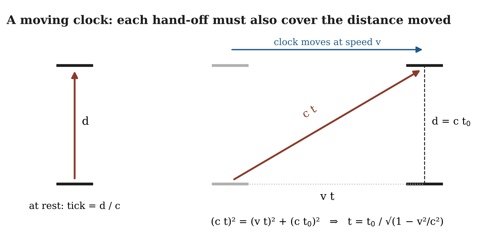

# 20.19 Why Is There a Speed Limit, and Why Is It the Same for Everyone?

The relation c = fλ needs care. If the wavelength is defined as the distance the excitation advances per recurrence, then fλ = c holds by definition. Its measured content is different: the speed is the same at every frequency (20.3). A rule built from discrete hand-offs between neighborhoods generally makes speed depend on frequency when the wavelength approaches the neighborhood scale. The measured absence of any such dependence, from radio waves to gamma rays, is therefore a consistency check the hand-off rule must pass.

The same speed for every observer in uniform motion is the second check. Our ontological proposal is that observers and their instruments are organizations maintained by the same relational medium that carries luminous propagation. The connection becomes concrete once a clock is defined.

A **clock** is a physical instantiation of a state change that divides the period over which the change occurs into discrete counted units. A pendulum's swings and an atom's transitions are clocks; the medium's update cycle is not a clock but what clocks are made of.

The light-clock geometry below illustrates how this ontology can map onto the measured slowing of moving clocks. It is an illustration, not a derivation of full Lorentz covariance from the substrate. Each tick of a clock is a state change of an organization that occupies space, so its parts must coordinate to complete the tick, and that coordination is handed across the medium at no more than c. Suppose the coordination runs a distance d across the clock, at right angles to the direction in which the clock will move, taking time t₀ = d/c when the clock is at rest. If the clock moves at speed v, each hand-off must also cover the distance the clock moves meanwhile, so its path becomes the long side of a right triangle. With hand-offs capped at c, Pythagoras gives each tick a duration

$$t = \frac{t_{0}}{\sqrt{1 - v^{2}/c^{2}}}$$

This is the measured slowing of moving clocks (muon lifetimes; atomic clocks flown on aircraft†). Coordination running along the direction of motion gives the same factor only if the moving organization also shortens along its motion by $\sqrt{1 - v^{2}/c^{2}}$. Lorentz needed that shortening, and John Bell (1976) showed that it follows when the organization's shape is itself held by fields. In our proposal the shape is held by the same hand-offs, so the shortening would have the same source as the slowing. Deriving the full Lorentz transformations from explicit substrate dynamics remains open.

**Figure 20.5.** An illustration of why a moving clock ticks slowly. Left: at rest, one tick needs a hand-off across the clock's width d, taking d/c. Right: moving at speed v, the hand-off must also cover the distance the clock travels during the tick, so its path is the long side of a right triangle. With every hand-off capped at c, the tick lasts longer by the factor 1/√(1 − v²/c²).

Two further consequences follow from treating c as a property of the medium.

-   Where the medium's activity differs, the hand-off rate should differ. Light passing close to a body with mass arrives later than it would through empty space (Shapiro delay, measured with radar and with the Cassini spacecraft†). In this account, the denser activity near the body slows the hand-off; Chapter 22 takes this up. Between Casimir plates the prediction is slightly faster propagation (Scharnhorst 1990†), far below anything measured so far.

-   A local measurement always gives the same c, because the local clocks and rulers change by the same factor. The account must show this agreement, not assume it.

Finally, Weber and Kohlrausch's 1856 measurement suggests where the medium's limit is set. If Chapter 19 earns the two coupling strengths, how strongly a change in the electric part drives the magnetic part and the reverse, the propagation speed follows from them, as Maxwell found. That would join Chapter 18's invariant rate to electromagnetism.

We do not yet derive the numerical value of c. The present burden is to identify what sets the propagation limit and remain consistent with every measurement of it.
