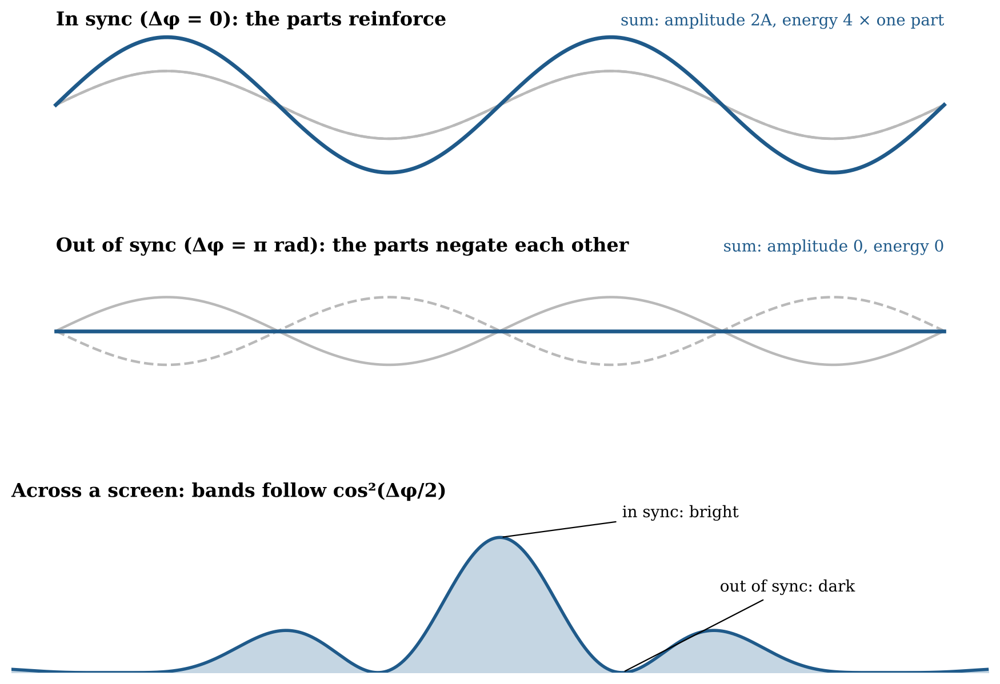

# 20.21 Interference as Signed Compatibility

When two coherent excitations overlap, their states jointly constrain which combined continuations are available. Interference is therefore a compatibility problem, and the compatibility must be *signed*. Measured dark bands have close to zero energy, and a score that only ranges from weak to strong cannot produce exact zeros. The parts must add with sign first; the energy then goes as the square of the sum.

For two parts of equal amplitude A arriving with a phase difference Δφ, the signed sum has amplitude $2A\cos(\Delta\varphi/2)$, and the energy goes as

$$I \propto  4A^{2}\cos^{2}\left( \frac{\Delta\varphi}{2} \right)$$

In sync (Δφ = 0) the parts reinforce one another and the energy is four times that of one part. Out of sync (Δφ = π rad) the parts negate one another and the energy is zero. The energy missing from the dark bands appears in the bright ones, so nothing is lost. The same signed rule with an orientation difference Δχ in place of Δφ gives Malus's cos²θ at a polarizing filter.

**Figure 20.6.** Interference as signed addition. Top: two parts in sync add to double the amplitude, and the energy, which goes as the square, is four times one part's. Middle: two parts out of sync negate each other, and the energy is zero. Bottom: across a screen, the phase difference changes steadily, giving bright and dark bands that follow cos²(Δφ/2). Energy missing from the dark bands appears in the bright bands.

Young's experiments established the stable pattern of reinforcement and negation (Young 1802, 1804). Hong, Ou and Mandel (1987) found interference structure in the joint counts of two excitations. The relational model must recover ordinary interference from the signed rule and must eventually state what that rule implies for joint counts; that statistical derivation remains open.
