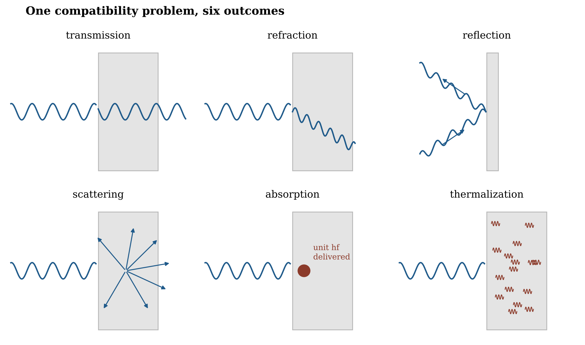

# 20.22 The Consequences of Interacting Light

What happens when a propagating excitation meets another organized structure? The outcome depends on how the two constrain one another and which continuations stay admissible:

$$\text{incoming open closure} + \text{encountered structure} \rightarrow \text{available continuations}$$

-   **Transmission:** a compatible continuation remains available through the region.

-   **Refraction:** continuity is preserved, but the local conditions change how phase accumulates, which bends the path.

-   **Reflection:** the boundary supports a continuation directed back into the region the excitation came from.

-   **Scattering:** the interaction makes several differently oriented continuations available.

-   **Absorption:** the excitation transfers its energy into a localized persistent organization strongly enough that the open closure is no longer maintained. This is where a unit of energy, hf, is resolved.

-   **Thermalization:** the transferred energy is spread across many local modes rather than kept as one propagating organization.

**Figure 20.7.** One compatibility problem, six outcomes. An incoming open closure meets an organized structure; which continuations remain admissible decides whether it passes through, bends, turns back, scatters, is absorbed (where a unit of energy is delivered) or is spread into heat.

Huygens's construction (1690) gave an early geometrical method for propagation, reflection and refraction. Modern optics describes these outcomes with highly successful wave, field and quantum formalisms. This proposal looks for the relational mechanism that lets one propagating geometry resolve into all of them, without a separate ontology for each.
