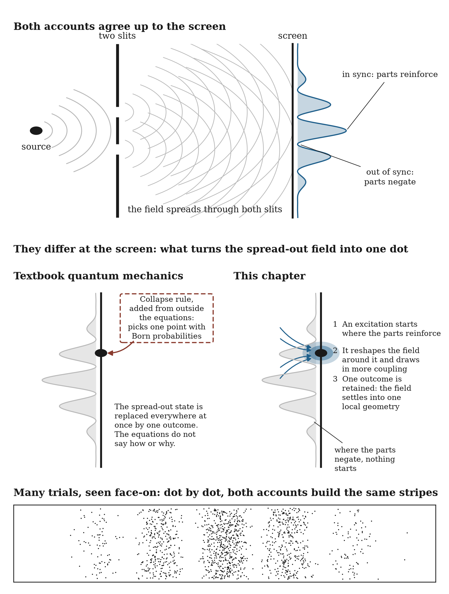

# 20.10 The Double Slit, Retold

The double slit experiment can now be told from beginning to end in this framework's terms.

The source sends out a field spread across the apparatus. The two slits are two openings the apparatus cuts into it. With both open, and nothing able to tell them apart, the field carries the relation between its two parts all the way to the screen, and at each point of the screen the parts combine according to the difference in their cycles. Where the two parts arrive in sync, they reinforce each other, and the coupling there is strong enough to set off an excitation and feed it. Where they arrive out of sync, they negate each other, and almost nothing is there to start one.

At the screen, a complete interaction, running from the source to one point on the screen, can close only where the field's parts reinforce strongly enough to support it. Where it closes, the excitation is retained. The alternatives, which would each have conditioned the field differently, cannot all be kept, and the dot is the one interaction that closed. Over many trials, the dots pile up where the parts reinforce and stay away from where they negate each other, and the stripes appear.

Add a detector at the slits, and it couples to the field differently at each slit. The difference between the slits is now on record in the detector, the two parts no longer arrive with one definite relation, and the cross term disappears. The parts no longer negate each other anywhere on the screen, so excitations can start across the whole spread. The dots still arrive one at a time, but the stripes are gone.

**Figure 20.2.** Both accounts predict the same stripes. They part at the screen: the textbook account adds a collapse rule from outside its equations, while here the field's own feedback amplifies one excitation where its parts reinforce, and that excitation is retained.

Nothing in this telling requires a particle to have traveled a hidden path, or a wave to vanish everywhere at the instant someone looks. Two separate questions have separate answers. The stripes come from how the field's parts recombine. The dots come from the field's interaction with the screen's detection capacity: like every detector, the screen registers only an excitation strong enough to change the state of the medium that retains the record.
