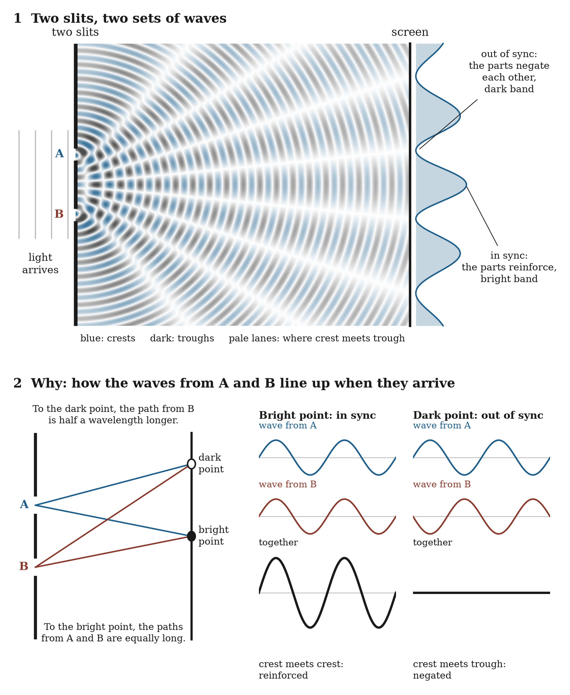

# 23.6 How the Parts Combine

Evidence of interference patterns is the clearest sign that something other than ordinary chance is at work.

Waves do not combine like chances. In quantum mechanics, each route contributes an *amplitude*, a quantity with a size and a phase, and the amplitudes are added before anything is squared to give a probability. The result contains an extra *cross term* that depends on the difference in phase between the routes. Where the phases agree, the cross term adds; where they are opposite, it subtracts. That is what the dark stripes are: places where both parts recombine to negate the amplitude of the propagating field.

**Figure 23.1.** Each slit sends out its own set of waves, and what reaches each point of the screen depends on how far each wave has traveled. Where the two paths are equal, the waves arrive in sync and reinforce each other; where one path is half a wavelength longer, they arrive out of sync and negate each other. The dark stripes are those places: where the two parts recombine out of sync, they negate the amplitude of the propagating field, and almost no dots land there.

In this framework the cross term is the mark of a field whose two parts arrive with a definite relation between their cycles. The schematic form is

combined result = part A + part B + a term depending on their relative phase

and the chapter's proposal is that the relative phase is the relative position of the two parts within the cycle earned in Return.

Waves in water also interfere, so phase alone does not make something quantum. Two further features do. First, the stripes are built from single, all-or-nothing events: the field arrives spread out and is recorded at a point. Second, the pattern responds to whether the difference between the routes is *on record anywhere*, even if nobody reads the record. The next two sections take those in turn.
